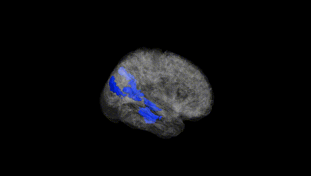
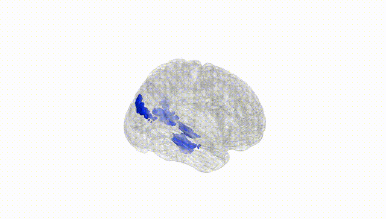
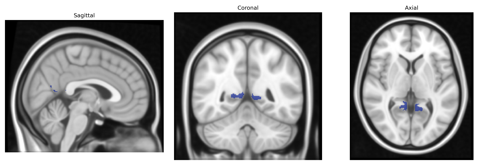
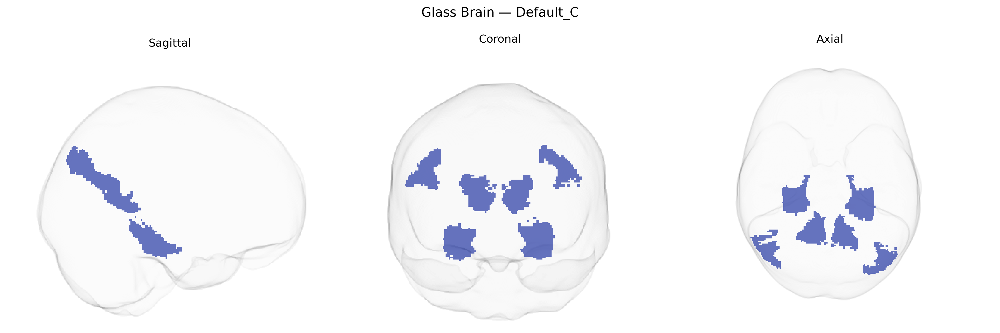

# Default_C
 
## Overview
 
The Bilateral Default_C region in the Yeo-17 atlas is a subdivision of the default mode network (DMN), a large-scale brain network engaged during internally focused cognition such as autobiographical memory, self-referential processing, mind-wandering, and aspects of social cognition. As a bilateral component, Default_C typically encompasses homologous cortical territories in both hemispheres, often involving midline and adjacent association areas that show high intrinsic functional connectivity at rest and decreased activity during externally demanding, goal-directed tasks. Functionally, this subdivision participates in integrating multimodal information to support internal mentation and the construction of a coherent sense of self across time, and it interacts dynamically with other DMN subdivisions and task-positive networks (e.g., frontoparietal and dorsal attention networks). There is no direct Wikipedia article for this specific Yeo-17 parcel; a closely related and encompassing structure is the [Default mode network](https://en.wikipedia.org/wiki/Default_mode_network).
 
The Bilateral Default_C region in the Yeo-17 atlas, part of the default mode network (DMN) often centered on medial prefrontal, posterior cingulate/precuneus, and angular gyrus territories, shows substantial heritability and robust genetic associations in large-scale imaging genetics studies. GWAS of resting-state functional connectivity and cortical thickness/volume (e.g., UK Biobank–based studies) have identified loci in genes involved in synaptic function, neuronal differentiation, and myelination (such as variants in or near APOE, MAPT, GRIN2B, and genes in glutamatergic and GABAergic pathways) that influence DMN structure and connectivity, including default network subregions overlapping Default_C. Polygenic risk scores for Alzheimer’s disease, schizophrenia, major depressive disorder, and autism spectrum disorder have been linked to altered DMN connectivity and morphology, with APOE ε4 and other AD risk variants consistently associated with reduced integrity and hypometabolism in posterior DMN areas. Schizophrenia and depression risk variants, particularly those affecting synaptic plasticity and calcium channel signaling, have been associated with DMN hyper- or hypoconnectivity patterns, while autism-related variants often relate to atypical long-range connectivity involving default network hubs. Additionally, GWAS of cognitive traits and educational attainment have shown that alleles conferring higher cognitive performance tend to be associated with stronger or more efficient connectivity and greater cortical thickness in DMN regions, implying that Default_C is a convergence zone for genetic influences on higher-order cognition and vulnerability to neuropsychiatric and neurodegenerative disorders.
 
*Overview generated by GPT-4o (2026).*
 
---
 
**Region ID:** 15  
**Hemisphere:** Bilateral  
**Atlas:** Yeo-17 
 
---
 
## Default_C – Black Background (Full Brain)
 

 
**Full Quality Version:** <a href="full_black.mp4" download>Download MP4</a>
 
---
 
## Default_C – White Background (Full Brain)
 

 
**Full Quality Version:** <a href="full_white.mp4" download>Download MP4</a>
 
---

## Triplanar View – T1 Background
 

 
---
 
## Triplanar View – Ghost Brain
 


