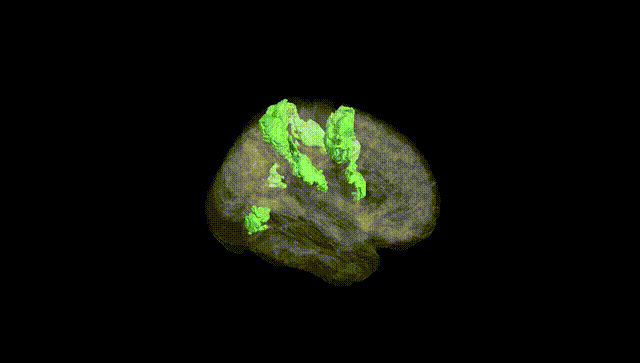
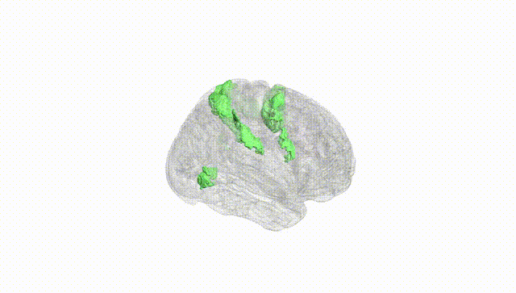
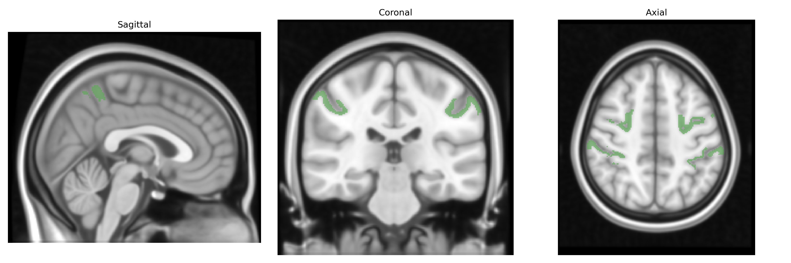
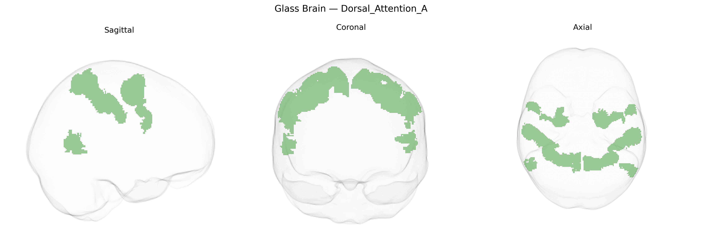

# Dorsal_Attention_A

## Overview

The Bilateral Dorsal_Attention_A region in the Yeo-17 atlas corresponds to a core subdivision of the dorsal attention network, a large-scale brain system implicated in top-down, goal-directed allocation of visual and spatial attention. This network comprises bilateral regions in the intraparietal sulcus and superior parietal lobule, along with portions of the frontal eye fields and adjacent dorsal frontal cortex, which collectively support the voluntary orienting, maintenance, and shifting of attention based on internal goals rather than external salience. Functionally, Dorsal_Attention_A is associated with the control of eye movements, spatial working memory, and the integration of sensory information with motor plans, enabling coordinated orienting toward behaviorally relevant stimuli. There is no direct Wikipedia page for “Bilateral Dorsal_Attention_A” or the exact Yeo-17 label; a closely related and encompassing structure is the dorsal attention network: https://en.wikipedia.org/wiki/Dorsal_attention_network

*Overview generated by GPT-4o (2026).*

---

**Region ID:** 6  
**Hemisphere:** Bilateral  
**Atlas:** Yeo-17 

---

## Dorsal_Attention_A – Black Background (Full Brain)

**Full Quality Version:** [Download MP4](full_black.mp4)

---

## Dorsal_Attention_A – White Background (Full Brain)

**Full Quality Version:** [Download MP4](full_white.mp4)

---

## Triplanar View – T1 Background

---

## Triplanar View – Ghost Brain


