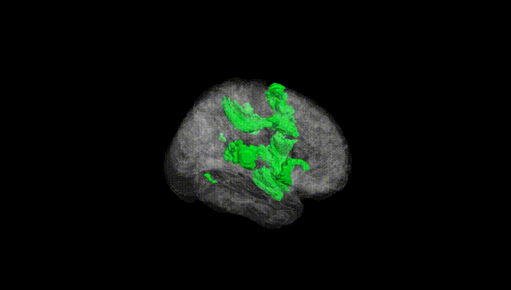
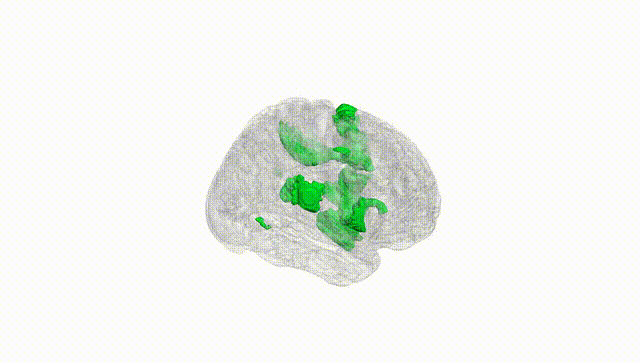
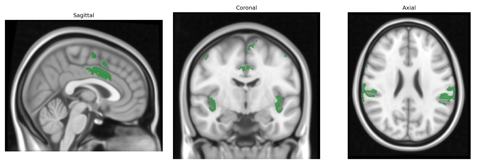
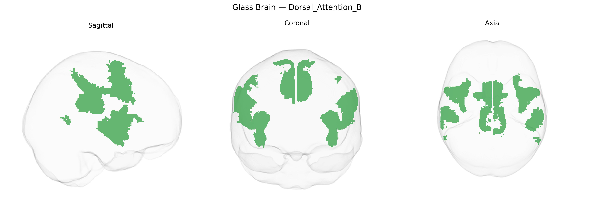

# Dorsal_Attention_B
 
## Overview
 
The Bilateral Dorsal_Attention_B region in the Yeo-17 atlas is part of the dorsal attention network, a large-scale cortical system implicated in top-down, goal-directed allocation of visual and spatial attention. This network typically includes portions of the intraparietal sulcus and superior parietal lobule, as well as frontal eye fields and adjacent dorsal frontal cortex, and is activated during tasks requiring voluntary orienting, visual search, saccadic eye movements, and maintenance of attention to behaviorally relevant stimuli. Functionally, it supports the selection and prioritization of sensory information, integration of spatial representations with motor plans, and coordination of attention with eye and hand movements. In the Yeo-17 parcellation, the “B” subdivision reflects a more specific subcomponent within the bilateral dorsal attention network, distinguished by its connectivity profile and task-evoked activation patterns. There is no direct Wikipedia link for this specific parcel; a closely related structure is the [Dorsal attention network](https://en.wikipedia.org/wiki/Attentional_networks#Dorsal_attention_network).
 
The Bilateral Dorsal_Attention_B region in the Yeo-17 atlas corresponds primarily to dorsal frontoparietal areas (including intraparietal sulcus and superior parietal regions plus frontal eye fields) that have been repeatedly implicated in genetic studies of attention, cognitive control, and visuospatial function. Twin and family studies indicate high heritability for dorsal attention network connectivity and activation, and large-scale imaging GWAS (e.g., UK Biobank–based studies) have reported associations between common variants and functional connectivity or cortical thickness in dorsal attention regions, including loci near genes involved in synaptic function and neurodevelopment (such as variants close to CNTNAP2, GRIN2B, and CACNA1C in some reports, though these are not specific to this subnetwork). Polygenic scores for educational attainment, general cognitive ability, and ADHD have been associated with altered structure or connectivity in dorsal attention areas, and ADHD GWAS loci overlap with genes influencing frontoparietal circuitry and attentional control. Moreover, dorsal attention regions show structural and functional alterations in schizophrenia, autism spectrum disorder, and mood disorders, with corresponding genetic correlations between these conditions and imaging-derived measures of parietal and frontal association cortex. However, no single gene or variant is uniquely or specifically tied to the Yeo-17 Bilateral Dorsal_Attention_B parcel; rather, its genetic architecture appears highly polygenic and shared with broader cognitive and psychiatric traits that affect frontoparietal attention networks.
 
*Overview generated by GPT-4o (2026).*
 
---
 
**Region ID:** 7  
**Hemisphere:** Bilateral  
**Atlas:** Yeo-17 
 
---
 
## Dorsal_Attention_B – Black Background (Full Brain)
 

 
**Full Quality Version:** <a href="full_black.mp4" download>Download MP4</a>
 
---
 
## Dorsal_Attention_B – White Background (Full Brain)
 

 
**Full Quality Version:** <a href="full_white.mp4" download>Download MP4</a>
 
---

## Triplanar View – T1 Background
 

 
---
 
## Triplanar View – Ghost Brain
 


