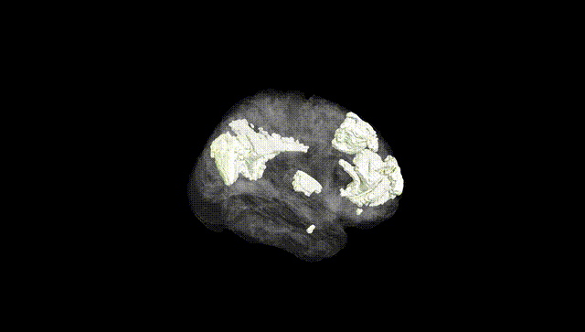
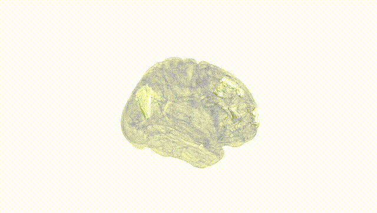
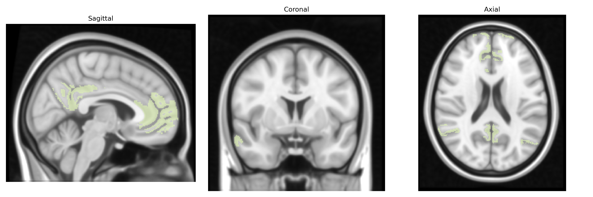
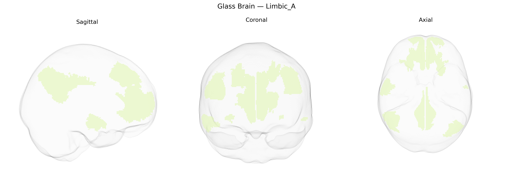

# Limbic_A

## Overview

The Bilateral Limbic_A network in the Yeo-17 atlas is a large-scale functional brain system encompassing limbic and paralimbic regions in both hemispheres, primarily involved in emotional processing, memory, autonomic regulation, and affective components of cognition. It typically includes key medial and basal structures such as portions of the anterior and posterior cingulate cortex, orbitofrontal cortex, medial prefrontal cortex, and medial temporal lobe regions closely associated with the hippocampal–amygdalar complex. Functionally, this network supports integration of internal bodily states with emotional valence, contributes to reward and punishment learning, and interfaces with both default-mode and salience-related systems to modulate attention and behavior in response to emotionally salient stimuli. There is no direct Wikipedia link for “Bilateral Limbic_A” as defined in the Yeo-17 atlas; a closely related structure and conceptual entry is the limbic system: https://en.wikipedia.org/wiki/Limbic_system

*Overview generated by GPT-4o (2026).*

---

**Region ID:** 16  
**Hemisphere:** Bilateral  
**Atlas:** Yeo-17 

---

## Limbic_A – Black Background (Full Brain)

**Full Quality Version:** [Download MP4](full_black.mp4)

---

## Limbic_A – White Background (Full Brain)

**Full Quality Version:** [Download MP4](full_white.mp4)

---

## Triplanar View – T1 Background

---

## Triplanar View – Ghost Brain


