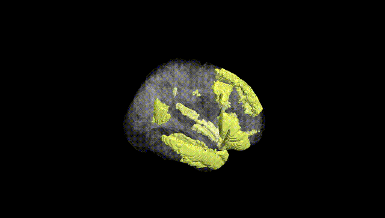
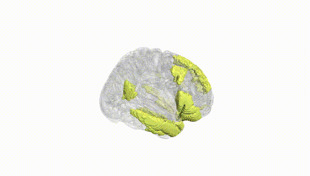
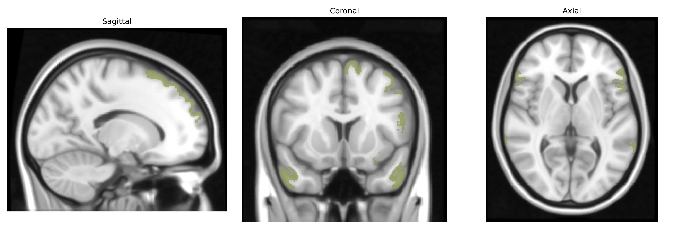
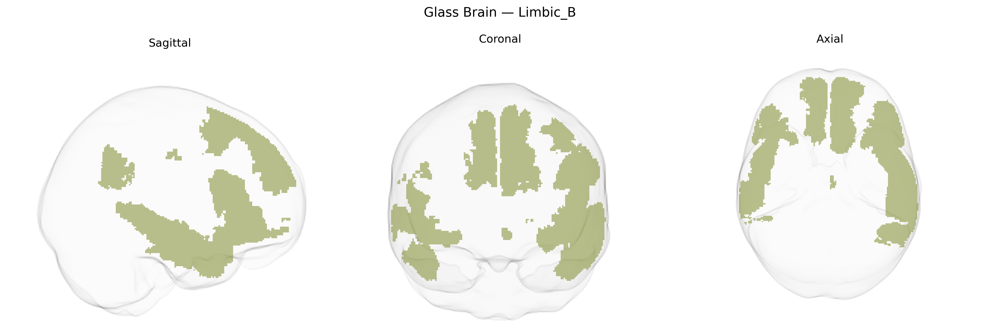

# Limbic_B

## Overview

The Bilateral Limbic_B network in the Yeo-17 atlas is a large-scale cortical functional network that encompasses limbic-related regions in both hemispheres, typically including portions of the medial temporal lobe (such as parahippocampal cortex), ventromedial prefrontal and orbitofrontal cortices, and adjacent temporal and cingulate areas. Functionally, this network is associated with affective processing, valuation, emotional memory, and aspects of internally oriented cognition, often interacting with the default mode and reward-related systems. It is defined by patterns of intrinsic functional connectivity observed in resting-state fMRI rather than by cytoarchitectonic or gross anatomical boundaries, and thus represents a distributed functional system rather than a single anatomical structure. There is no direct Wikipedia page for “Bilateral Limbic_B (Yeo-17),” but it is closely related to limbic system structures such as the parahippocampal gyrus: https://en.wikipedia.org/wiki/Parahippocampal_gyrus

*Overview generated by GPT-4o (2026).*

---

**Region ID:** 17  
**Hemisphere:** Bilateral  
**Atlas:** Yeo-17 

---

## Limbic_B – Black Background (Full Brain)

**Full Quality Version:** [Download MP4](full_black.mp4)

---

## Limbic_B – White Background (Full Brain)

**Full Quality Version:** [Download MP4](full_white.mp4)

---

## Triplanar View – T1 Background

---

## Triplanar View – Ghost Brain


