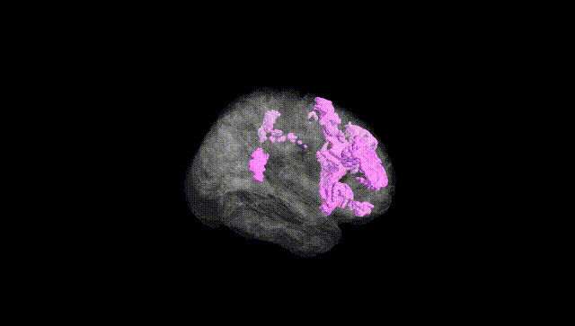
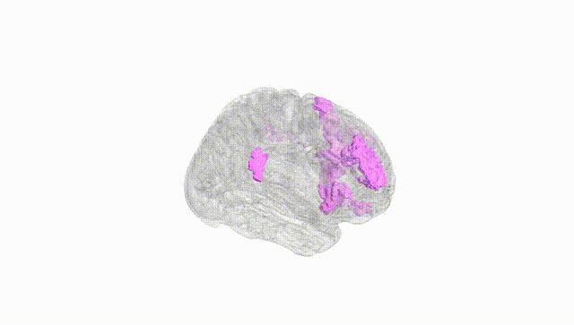
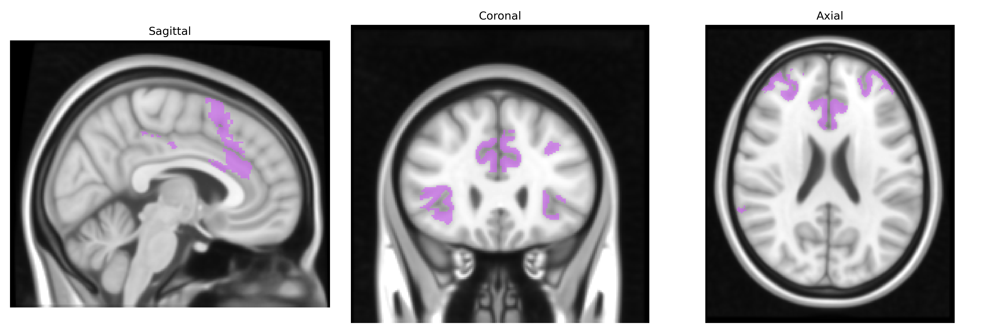
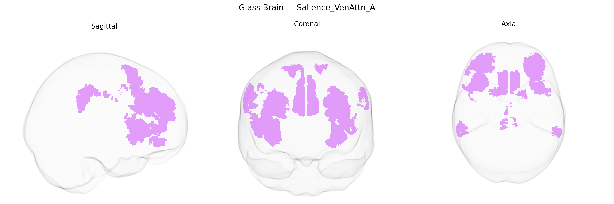

# Salience_VenAttn_A

## Overview

The Bilateral Salience_VenAttn_A region in the Yeo-17 atlas refers to a distributed, bilateral functional network that combines aspects of the salience network and the ventral attention network. This system typically includes portions of the anterior insula, dorsal anterior cingulate cortex (dACC), frontal operculum, and adjacent frontal and parietal regions, and is implicated in detecting behaviorally relevant internal and external stimuli, switching between large-scale networks (such as default mode and executive control networks), and orienting attention in a stimulus-driven (“bottom-up”) manner. Functionally, it contributes to the rapid evaluation of salient sensory, emotional, or interoceptive signals and the allocation of processing resources needed for adaptive responses, including autonomic and cognitive control adjustments. There is no direct Wikipedia entry for “Bilateral Salience_VenAttn_A” as defined in the Yeo-17 atlas; a closely related structure/network with substantial overlap is the salience network: https://en.wikipedia.org/wiki/Salience_network

*Overview generated by GPT-4o (2026).*

---

**Region ID:** 8  
**Hemisphere:** Bilateral  
**Atlas:** Yeo-17 

---

## Salience_VenAttn_A – Black Background (Full Brain)

**Full Quality Version:** [Download MP4](full_black.mp4)

---

## Salience_VenAttn_A – White Background (Full Brain)

**Full Quality Version:** [Download MP4](full_white.mp4)

---

## Triplanar View – T1 Background

---

## Triplanar View – Ghost Brain


