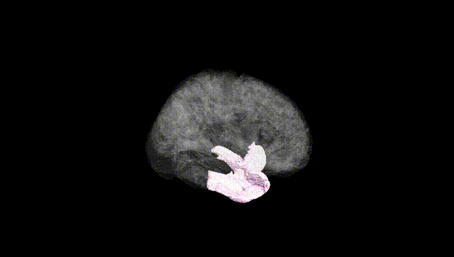
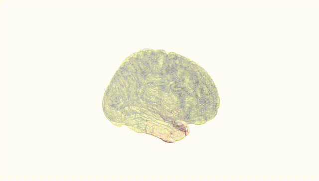
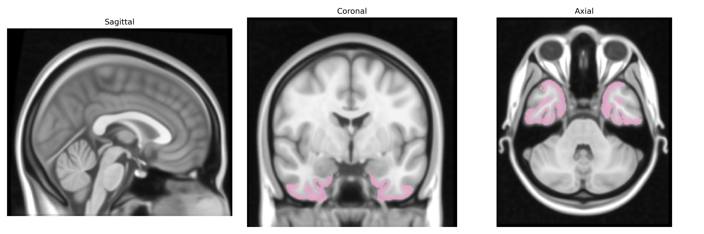
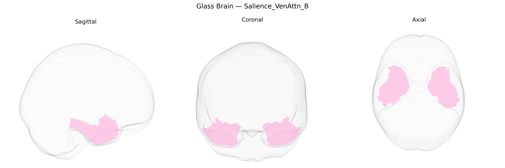

# Salience_VenAttn_B

## Overview

The Bilateral Salience_VenAttn_B region in the Yeo-17 atlas refers to a set of bilateral cortical territories belonging to a functional network that combines elements of the salience network and the ventral attention network. This network typically involves portions of the anterior insula, dorsal anterior cingulate cortex, frontal operculum, and adjacent frontal and parietal regions that are implicated in detecting behaviorally relevant or salient internal and external stimuli, facilitating rapid switching between brain networks, and reorienting attention to unexpected events. Functionally, these areas integrate sensory, emotional, and cognitive information to guide adaptive responses, particularly under conditions of uncertainty or conflict, and are heavily involved in autonomic regulation and interoception. There is no direct Wikipedia link for “Bilateral Salience_VenAttn_B” or the Yeo-17–specific parcel, but a closely related structure/network is described here: https://en.wikipedia.org/wiki/Salience_network

*Overview generated by GPT-4o (2026).*

---

**Region ID:** 9  
**Hemisphere:** Bilateral  
**Atlas:** Yeo-17 

---

## Salience_VenAttn_B – Black Background (Full Brain)

**Full Quality Version:** [Download MP4](full_black.mp4)

---

## Salience_VenAttn_B – White Background (Full Brain)

**Full Quality Version:** [Download MP4](full_white.mp4)

---

## Triplanar View – T1 Background

---

## Triplanar View – Ghost Brain


