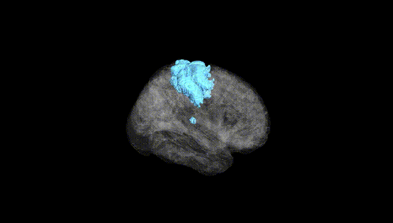
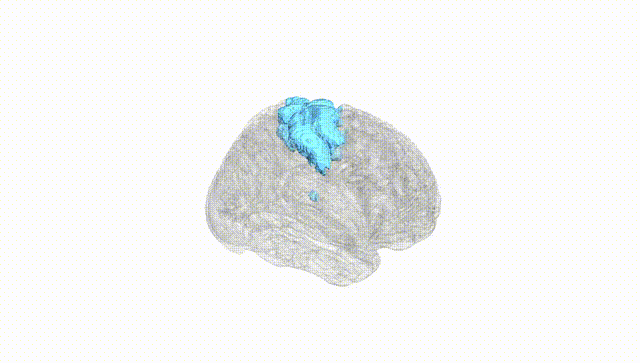
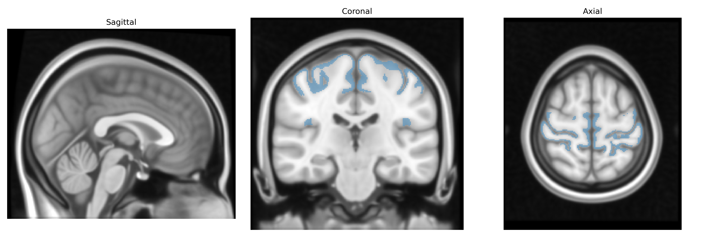
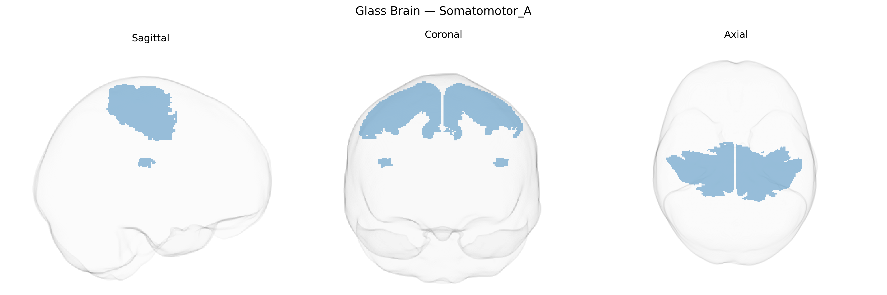

# Somatomotor_A
 
## Overview
 
The Bilateral Somatomotor_A network in the Yeo-17 atlas corresponds primarily to core somatomotor cortices in both hemispheres, encompassing regions along the precentral and postcentral gyri that subserve execution and primary representation of voluntary movement and somatic sensation. This functional group includes primary motor and primary somatosensory areas that are topographically organized (somatotopic maps for different body parts) and is strongly involved in fine motor control, proprioception, and processing of tactile input. It forms dense reciprocal connections with premotor, supplementary motor, and cerebellar circuits, as well as thalamic relay nuclei, supporting sensorimotor integration and real-time feedback during movement. There is no direct Wikipedia article for “Bilateral Somatomotor_A”; a closely related structure is the [Primary motor cortex](https://en.wikipedia.org/wiki/Primary_motor_cortex).
 
The Bilateral Somatomotor_A region in the Yeo-17 atlas, encompassing primary and secondary sensorimotor cortices, has been linked through GWAS and imaging genetics studies to variants influencing cortical thickness, surface area, and functional activation in motor and somatosensory areas, with many associations mapping to genes involved in neurodevelopment, axon guidance, synaptic function, and myelination (for example, variants near genes such as MAPT, MIR137, and several cell-adhesion and cytoskeletal regulators in large consortia like ENIGMA and UK Biobank). Polygenic scores for general cognitive ability, educational attainment, and brain size show correlations with structural metrics in this region, while motor-related traits—including grip strength, physical activity, and handedness—have been genetically co-mapped with somatomotor networks. Somatomotor cortex structure and function exhibit genetic correlations with several neuropsychiatric and neurodevelopmental disorders, including schizophrenia, autism spectrum disorder, and ADHD, largely via distributed polygenic effects on cortical development and connectivity rather than region-specific single-gene effects. In neurological conditions, motor cortex measures influenced by genetic risk loci (such as those for ALS and Parkinson’s disease) often show altered thickness, excitability, or connectivity in somatomotor territories, though these effects are typically modest and embedded in broader network-level vulnerability. Overall, genetic associations for the Bilateral Somatomotor_A region reflect highly polygenic, pleiotropic influences that shape sensorimotor circuitry alongside general brain and body traits, without strong evidence for unique, region-exclusive genetic determinants.
 
*Overview generated by GPT-4o (2026).*
 
---
 
**Region ID:** 3  
**Hemisphere:** Bilateral  
**Atlas:** Yeo-17 
 
---
 
## Somatomotor_A – Black Background (Full Brain)
 

 
**Full Quality Version:** <a href="full_black.mp4" download>Download MP4</a>
 
---
 
## Somatomotor_A – White Background (Full Brain)
 

 
**Full Quality Version:** <a href="full_white.mp4" download>Download MP4</a>
 
---

## Triplanar View – T1 Background
 

 
---
 
## Triplanar View – Ghost Brain
 


