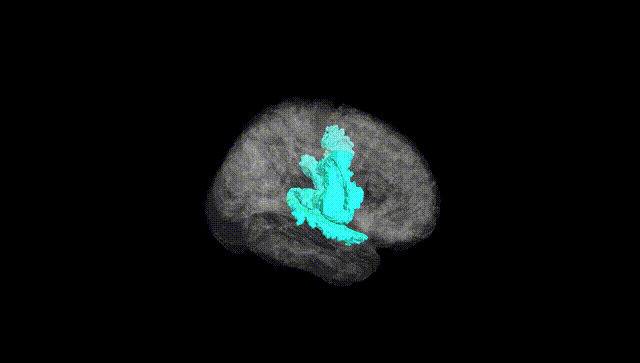
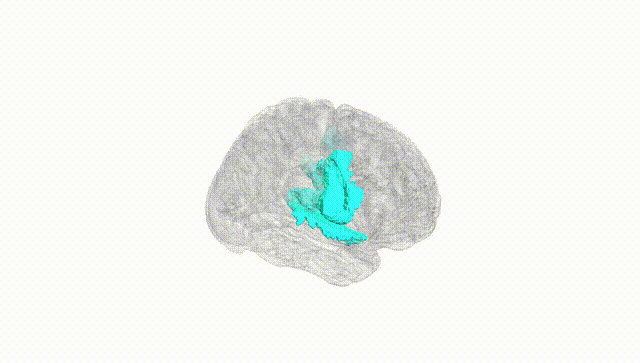
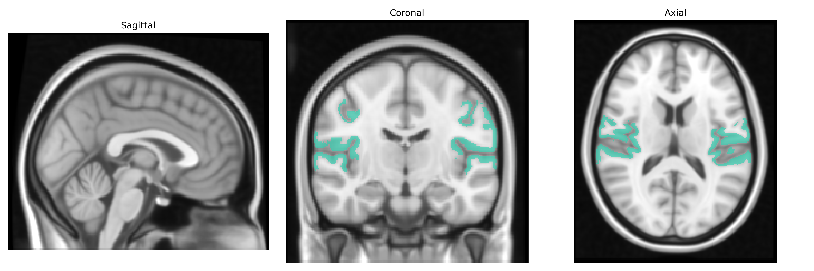
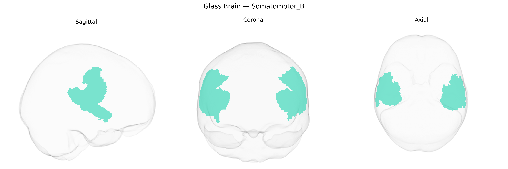

# Somatomotor_B

## Overview

The Bilateral Somatomotor_B network in the Yeo-17 atlas is a large-scale functional network encompassing bilateral primary and secondary somatosensory and motor-related cortices involved in the planning, execution, and sensory feedback of voluntary movement. It typically includes regions along the precentral and postcentral gyri and adjacent parietal and frontal areas that integrate proprioceptive, tactile, and motor information to support fine motor control, sensorimotor integration, and body representation. This network is functionally distinguished from other Yeo-defined networks (such as dorsal attention or default mode) by its strong coupling to sensorimotor tasks and its characteristic resting-state connectivity profile, which reveals robust bilateral synchronization across homotopic motor and somatosensory regions. There is no direct Wikipedia link specific to “Bilateral Somatomotor_B” in the Yeo-17 atlas; a related and commonly referenced structure is the primary motor cortex: https://en.wikipedia.org/wiki/Primary_motor_cortex.

*Overview generated by GPT-4o (2026).*

---

**Region ID:** 4  
**Hemisphere:** Bilateral  
**Atlas:** Yeo-17 

---

## Somatomotor_B – Black Background (Full Brain)

**Full Quality Version:** [Download MP4](full_black.mp4)

---

## Somatomotor_B – White Background (Full Brain)

**Full Quality Version:** [Download MP4](full_white.mp4)

---

## Triplanar View – T1 Background

---

## Triplanar View – Ghost Brain


