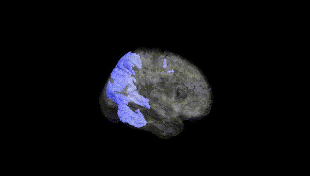
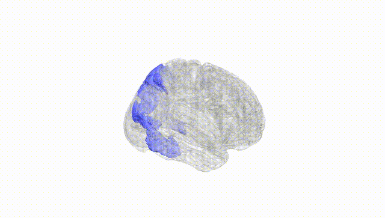
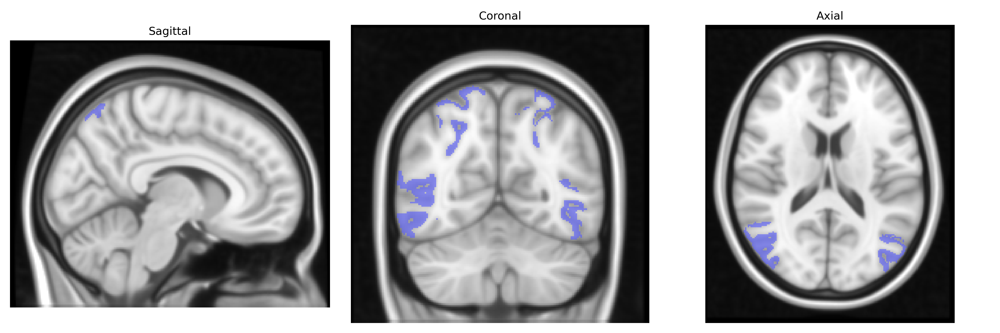
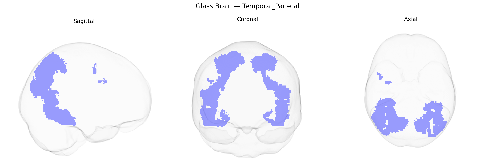

# Temporal_Parietal

## Overview

The bilateral temporal-parietal region in the Yeo-17 atlas refers to a functional network spanning lateral aspects of the temporal and inferior parietal cortices in both hemispheres, typically encompassing portions of the superior temporal gyrus, middle temporal gyrus, and angular/supramarginal gyri. This territory is strongly associated with higher-order associative functions, including multimodal sensory integration, language processing (particularly semantic and phonological aspects), social cognition and mentalizing (often overlapping with the temporoparietal junction), and aspects of attention reorienting. Functionally, it often participates in large-scale networks such as the default mode and frontoparietal control networks, supporting the integration of external sensory information with internal representations and contextual knowledge. There is no direct Wikipedia link for the “Bilateral Temporal_Parietal” Yeo-17 region as defined in that atlas, but a closely related structure is the temporoparietal junction: https://en.wikipedia.org/wiki/Temporoparietal_junction

*Overview generated by GPT-4o (2026).*

---

**Region ID:** 5  
**Hemisphere:** Bilateral  
**Atlas:** Yeo-17 

---

## Temporal_Parietal – Black Background (Full Brain)

**Full Quality Version:** [Download MP4](full_black.mp4)

---

## Temporal_Parietal – White Background (Full Brain)

**Full Quality Version:** [Download MP4](full_white.mp4)

---

## Triplanar View – T1 Background

---

## Triplanar View – Ghost Brain


