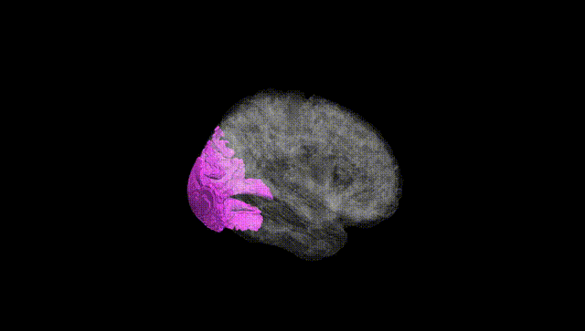
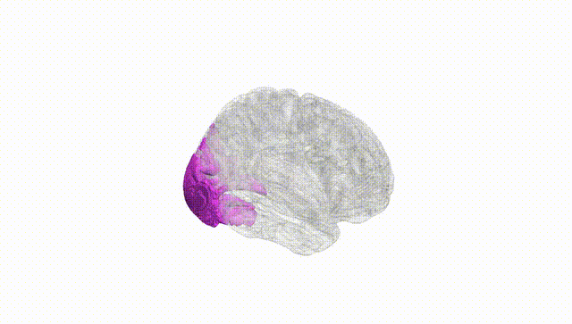
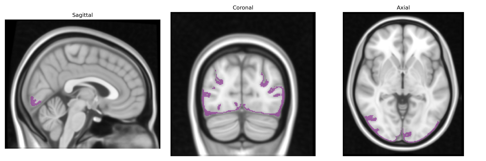
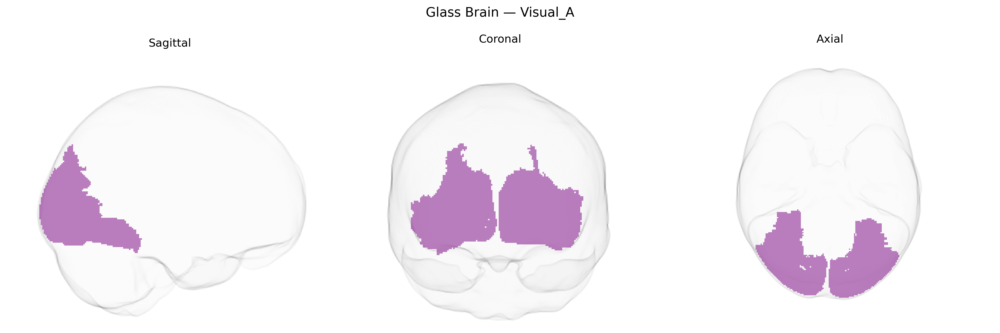

# Visual_A
 
## Overview
 
The Bilateral Visual_A region in the Yeo-17 atlas corresponds to early visual cortical areas located bilaterally along the occipital lobe, encompassing primary and adjacent visual fields involved in the initial stages of visual processing. This network includes cortex near and along the calcarine sulcus, largely overlapping with early retinotopic areas specialized for encoding basic visual features such as orientation, contrast, spatial frequency, and simple motion. Neurons in this region exhibit precise retinotopic organization, with neighboring cells responding to adjacent points in the visual field, and receive dense thalamocortical input from the lateral geniculate nucleus of the thalamus. Activity in Bilateral Visual_A provides foundational visual representations that support higher-order processing in downstream visual association cortices. There is no direct link for “Bilateral Visual_A,” but it is closely related to [Primary visual cortex](https://en.wikipedia.org/wiki/Primary_visual_cortex).
 
The Bilateral Visual_A region in the Yeo-17 atlas corresponds primarily to early visual cortex (including parts of calcarine/occipital areas), for which genetic associations derive mainly from GWAS of cortical surface area and thickness, visual processing traits, and related neuropsychiatric conditions. Large imaging-genetics studies (e.g., ENIGMA, UK Biobank) have identified multiple loci affecting occipital and primary visual cortical surface area and thickness, including variants near genes involved in neurodevelopment and synaptic function such as HMGA2, FGFR3, KIAA0586, DAAM1, and others, though mapping of specific loci to Yeo-17 subregions is indirect. GWAS of visual acuity and refractive error (e.g., myopia) have implicated genes involved in retinal and visual pathway development (e.g., GJD2, RASGRF1, ZIC2), which may influence structural and functional characteristics of early visual cortex. Polygenic risk for psychiatric and neurodevelopmental disorders—particularly schizophrenia, bipolar disorder, and autism spectrum disorder—shows distributed effects across cortex, with some studies reporting associations between disorder-related polygenic scores and reduced thickness or altered activation in occipital/visual regions that would overlap the Visual_A network. In addition, GWAS of general cognitive ability and educational attainment show polygenic influences on global and regional cortical morphology that extend into visual areas, though these effects are modest and highly distributed. Overall, genetic associations for the Bilateral Visual_A region are largely shared with broader occipital and early visual cortex measures, with no single disorder- or trait-specific locus uniquely and robustly assigned to this precise Yeo-17 parcel in current literature.
 
*Overview generated by GPT-4o (2026).*
 
---
 
**Region ID:** 1  
**Hemisphere:** Bilateral  
**Atlas:** Yeo-17 
 
---
 
## Visual_A – Black Background (Full Brain)
 

 
**Full Quality Version:** <a href="full_black.mp4" download>Download MP4</a>
 
---
 
## Visual_A – White Background (Full Brain)
 

 
**Full Quality Version:** <a href="full_white.mp4" download>Download MP4</a>
 
---

## Triplanar View – T1 Background
 

 
---
 
## Triplanar View – Ghost Brain
 


