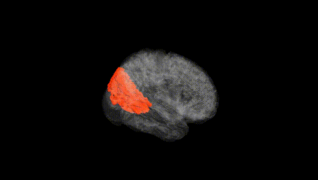
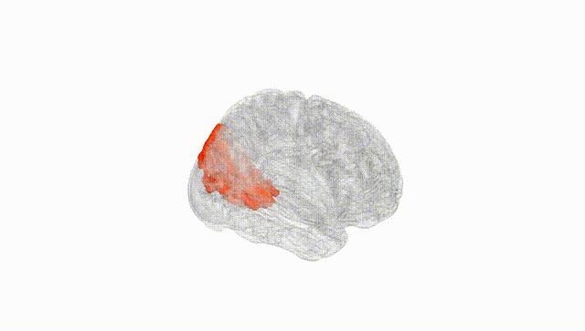
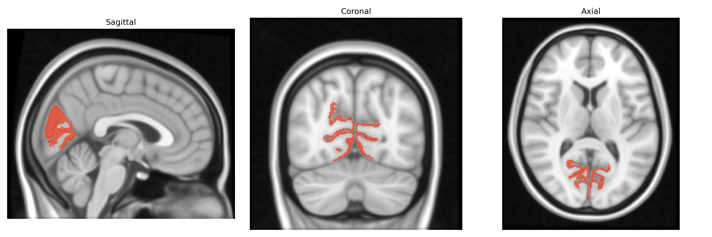
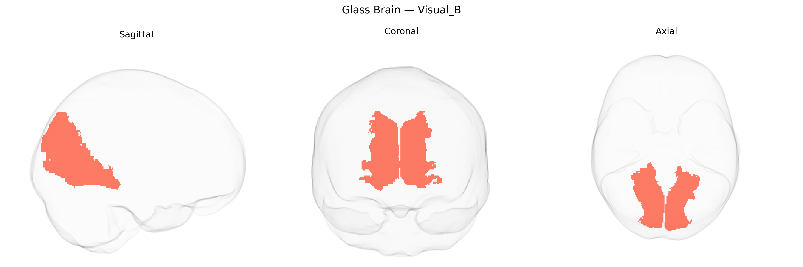

# Visual_B
 
## Overview
 
The Bilateral Visual_B region in the Yeo-17 atlas is a functional network component within occipital and adjacent ventral temporal cortex associated with intermediate-to-higher order visual processing. It typically encompasses portions of extrastriate visual areas beyond primary visual cortex (V1), including regions involved in contour integration, shape processing, object recognition, and aspects of visuospatial analysis. This network supports transformation of basic visual features (such as orientation, contrast, and motion detected in early visual cortex) into more complex representations that underlie perception of objects and scenes, and it interacts with both dorsal and ventral visual streams for integrating form, space, and attention. There is no direct Wikipedia article for “Bilateral Visual_B”; a closely related structure is [Visual cortex](https://en.wikipedia.org/wiki/Visual_cortex).
 
The Bilateral Visual_B region in the Yeo-17 atlas corresponds largely to higher-order visual association cortex (including parts of lateral occipital and ventral visual areas), and genetic studies link variability in its structure and function to polygenic influences shared with general brain development, cognitive traits, and neuropsychiatric risk. GWAS of cortical thickness and surface area (e.g., ENIGMA and UK Biobank–based studies) indicate that variants near genes involved in synaptic development and axon guidance (such as MEF2C, FGFR1, and genes in Wnt and semaphorin pathways) contribute to interindividual differences in occipital and lateral visual regions overlapping Visual_B. Polygenic scores for educational attainment, intelligence, and intracranial volume show positive associations with greater surface area and more robust functional connectivity in higher-order visual networks, while genetic risk for disorders such as schizophrenia, autism spectrum disorder, and major depression has been associated with altered occipital/visual network connectivity and morphology in regions that map onto the Visual_B system, suggesting shared genetic architecture between visual association cortex organization and vulnerability to psychiatric conditions. In addition, GWAS of resting-state functional connectivity and network topology report that visual network strength, including connections linking Visual_B to dorsal attention and default-mode networks, is heritable and influenced by loci that overlap with those implicated in cognitive performance and neurodevelopmental traits, although no single gene or variant has been identified as specifically and uniquely tied to the Bilateral Visual_B parcel itself.
 
*Overview generated by GPT-4o (2026).*
 
---
 
**Region ID:** 2  
**Hemisphere:** Bilateral  
**Atlas:** Yeo-17 
 
---
 
## Visual_B – Black Background (Full Brain)
 

 
**Full Quality Version:** <a href="full_black.mp4" download>Download MP4</a>
 
---
 
## Visual_B – White Background (Full Brain)
 

 
**Full Quality Version:** <a href="full_white.mp4" download>Download MP4</a>
 
---

## Triplanar View – T1 Background
 

 
---
 
## Triplanar View – Ghost Brain
 


