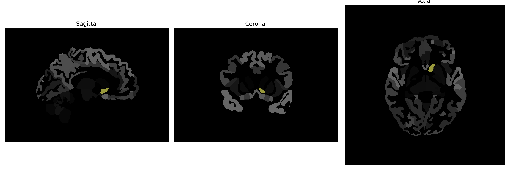

# Accumbens-Area

## Overview

The Left Accumbens-Area, part of the ventral striatum, is a subcortical structure involved in the brain's reward circuit. It plays a crucial role in processing rewarding stimuli, motivation, pleasure, and reinforcement learning. Anatomically, it is situated at the intersection of the caudate nucleus and the putamen and is predominantly characterized by medium spiny neurons rich in dopamine receptors. This area participates in cognitive processes related to reward anticipation, decision-making, and emotional behaviors.

There is no direct Wikipedia link for the Left Accumbens-Area from the brainCOLOR Atlas. However, a related structure within which it resides is the Nucleus Accumbens. For more information on the Nucleus Accumbens, refer to: https://en.wikipedia.org/wiki/Nucleus_accumbens

*Overview generated by GPT-4o (2026).*

---

**Region ID:** 2  
**Hemisphere:** Left  
**Atlas:** brainCOLOR 

---

## Full Brain – Black Background

**Full Quality Version:** [Download MP4](full_black.mp4)

---

## Full Brain – White Background

**Full Quality Version:** [Download MP4](full_white.mp4)

---

## Hemisphere Only – Black Background

**Full Quality Version:** [Download MP4](hemi_black.mp4)

---

## Hemisphere Only – White Background

**Full Quality Version:** [Download MP4](hemi_white.mp4)

---

## Triplanar View (Centered on ROI)

