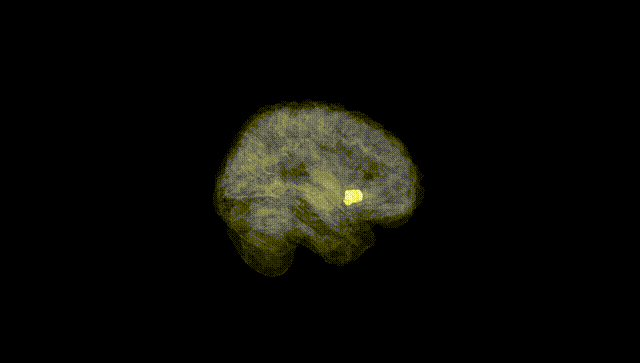
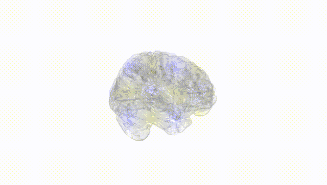
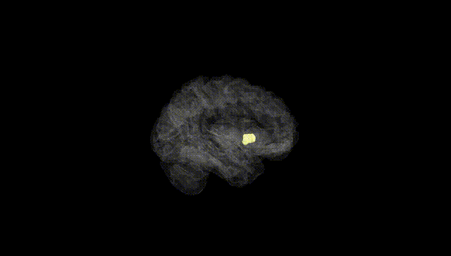
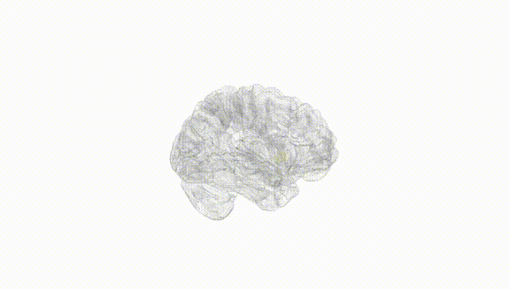
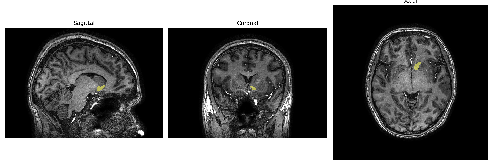
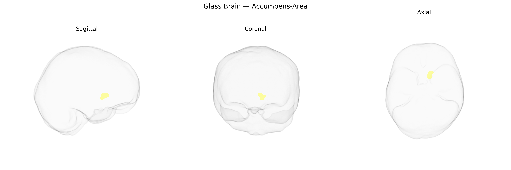

# Accumbens-Area

## Overview

The Left Accumbens-area, typically referred to as the left nucleus accumbens, is a subcortical gray matter structure located in the ventral striatum at the junction of the caudate nucleus and putamen, adjacent to the anterior limb of the internal capsule and ventral to the head of the caudate. It is a key component of the mesolimbic and mesocorticolimbic dopamine pathways and plays a central role in reward processing, motivation, reinforcement learning, and aspects of addiction-related behavior. Afferent inputs arise primarily from the prefrontal cortex, amygdala, hippocampus, and dopaminergic neurons of the ventral tegmental area, while major efferent projections target the ventral pallidum and, indirectly, thalamic and cortical regions, thereby influencing goal-directed and affective behavior. The “Left Accumbens-area” label in the brainCOLOR Atlas denotes the left-hemispheric homolog of this nucleus as parcellated for structural and functional neuroimaging analyses. There is no direct Wikipedia page for “Left Accumbens-area”; a closely related and encompassing structure is the nucleus accumbens: https://en.wikipedia.org/wiki/Nucleus_accumbens

*Overview generated by GPT-4o (2026).*

---

**Region ID:** 2  
**Hemisphere:** Left  
**Atlas:** brainCOLOR 

---

## Accumbens-Area – Black Background (Full Brain)

**Full Quality Version:** [Download MP4](full_black.mp4)

---

## Accumbens-Area – White Background (Full Brain)

**Full Quality Version:** [Download MP4](full_white.mp4)

---

## Accumbens-Area – Black Background (Hemisphere)

**Full Quality Version:** [Download MP4](hemi_black.mp4)

---

## Accumbens-Area – White Background (Hemisphere)

**Full Quality Version:** [Download MP4](hemi_white.mp4)

---

## Triplanar View – T1 Background

---

## Triplanar View – Ghost Brain


