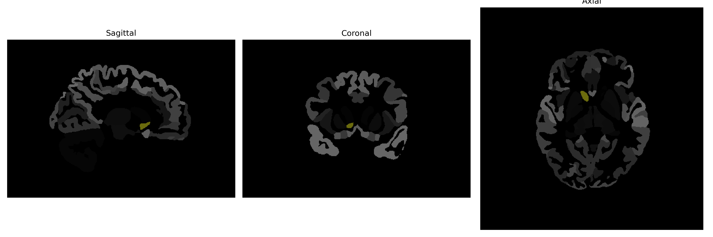

# Accumbens-Area

## Overview

The Right Accumbens-Area is a key component of the brain's reward circuitry, primarily involved in processing pleasurable experiences and reward-learning. Situated in the basal forebrain, it forms part of the nucleus accumbens, which is largely made up of two core regions: the core and the shell. This area plays a crucial role in the modulation of dopamine, a neurotransmitter essential for reward and motivation. It integrates information from the limbic system to influence motor systems, thereby affecting decision-making and behavioral responses to stimuli associated with rewards. Dysregulation within this area is often linked to psychiatric disorders such as addiction and depression.

There is no direct Wikipedia link for the Right Accumbens-Area. However, more general information on the nucleus accumbens can be found at: https://en.wikipedia.org/wiki/Nucleus_accumbens

*Overview generated by GPT-4o (2026).*

---

**Region ID:** 1  
**Hemisphere:** Right  
**Atlas:** brainCOLOR 

---

## Full Brain – Black Background

**Full Quality Version:** [Download MP4](full_black.mp4)

---

## Full Brain – White Background

**Full Quality Version:** [Download MP4](full_white.mp4)

---

## Hemisphere Only – Black Background

**Full Quality Version:** [Download MP4](hemi_black.mp4)

---

## Hemisphere Only – White Background

**Full Quality Version:** [Download MP4](hemi_white.mp4)

---

## Triplanar View (Centered on ROI)

