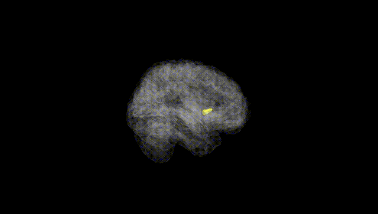
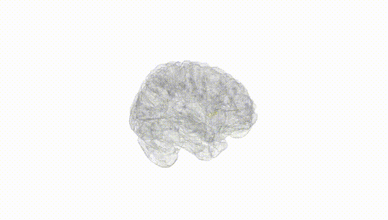
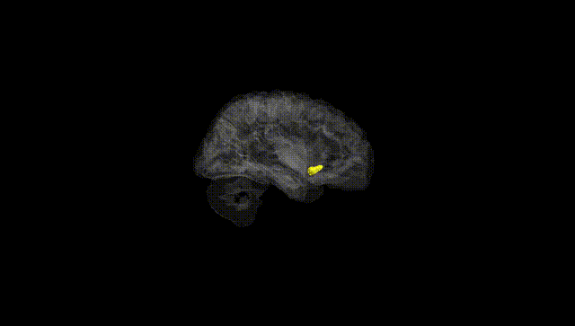
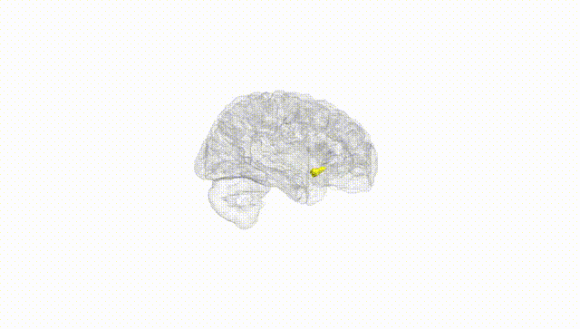
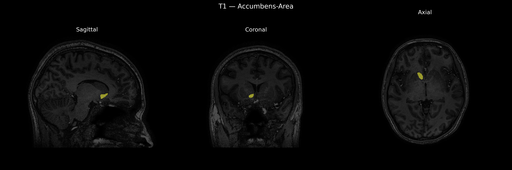
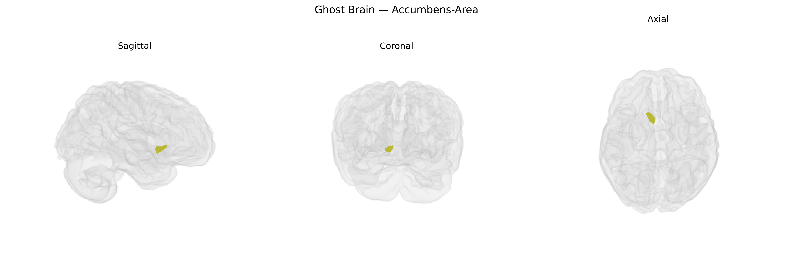

# Accumbens-Area

## Overview

The Right Accumbens-Area, as delineated in the brainCOLOR Atlas, corresponds to the right nucleus accumbens, a ventral striatal structure located at the junction of the caudate nucleus and putamen in the basal forebrain, just rostral to the anterior commissure. It is primarily composed of medium spiny GABAergic neurons, receiving dense dopaminergic input from the ventral tegmental area as well as glutamatergic afferents from the prefrontal cortex, hippocampus, and amygdala. Efferent projections largely target the ventral pallidum and, via indirect pathways, the mediodorsal thalamus and limbic cortices, integrating motivational, emotional, and cognitive information to modulate goal-directed behavior and reward processing. Functionally, the right nucleus accumbens is implicated in reinforcement learning, hedonic valuation, incentive salience, and addiction-related circuitry, and participates in circuits underlying mood regulation and decision-making. There is no direct Wikipedia link specifically for “Right Accumbens-Area” from the brainCOLOR Atlas; a closely related structure with a detailed entry is the nucleus accumbens: https://en.wikipedia.org/wiki/Nucleus_accumbens

*Overview generated by GPT-4o (2026).*

---

**Region ID:** 1  
**Hemisphere:** Right  
**Atlas:** brainCOLOR 

---

## Full Brain – Black Background

**Full Quality Version:** [Download MP4](full_black.mp4)

---

## Full Brain – White Background

**Full Quality Version:** [Download MP4](full_white.mp4)

---

## Hemisphere Only – Black Background

**Full Quality Version:** [Download MP4](hemi_black.mp4)

---

## Hemisphere Only – White Background

**Full Quality Version:** [Download MP4](hemi_white.mp4)

---

## Triplanar View – T1 Background

---

## Triplanar View – Ghost Brain


