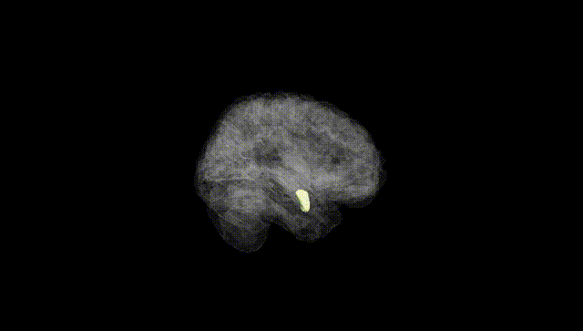
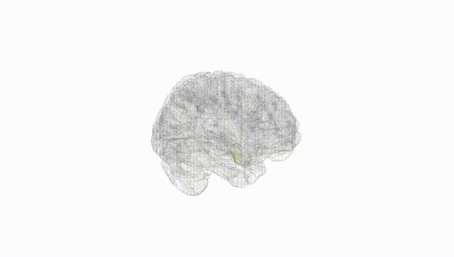
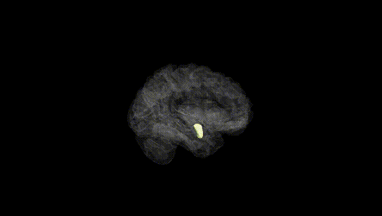
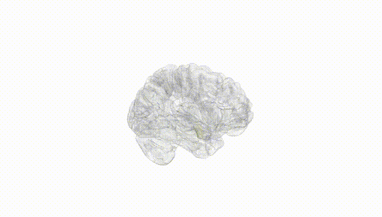
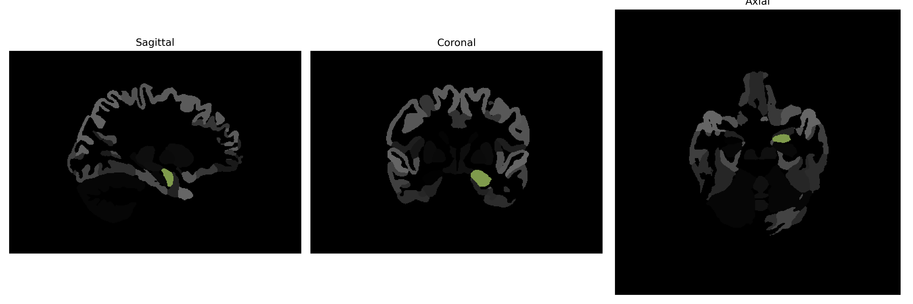

# Amygdala

## Overview

The Left Amygdala is part of the amygdaloid complex, located within the temporal lobe of the brain. This almond-shaped structure is involved in processing emotions such as fear, pleasure, and anger. It plays a crucial role in the formation and storage of memories associated with emotional events, acting as a central hub in the emotional processing network. The amygdala's connections with other brain regions, including the prefrontal cortex and hippocampus, facilitate its role in mediating social behaviors and recognition of emotional stimuli. It contributes to the modulation of threat detection and the coordination of appropriate behavioral responses.

There is no direct link for the Left Amygdala in the brainCOLOR Atlas. However, for more information about the amygdala in general, a related area can be found on Wikipedia: [Amygdala](https://en.wikipedia.org/wiki/Amygdala)

*Overview generated by GPT-4o (2026).*

---

**Region ID:** 4  
**Hemisphere:** Left  
**Atlas:** brainCOLOR 

---

## Full Brain – Black Background

**Full Quality Version:** [Download MP4](full_black.mp4)

---

## Full Brain – White Background

**Full Quality Version:** [Download MP4](full_white.mp4)

---

## Hemisphere Only – Black Background

**Full Quality Version:** [Download MP4](hemi_black.mp4)

---

## Hemisphere Only – White Background

**Full Quality Version:** [Download MP4](hemi_white.mp4)

---

## Triplanar View (Centered on ROI)

