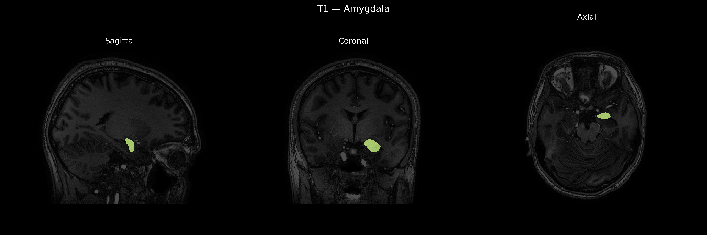
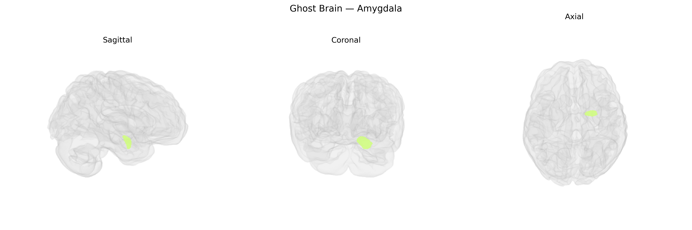

# Amygdala
 
## Overview
 
The Left Amygdala is a paired, almond-shaped collection of nuclei located in the medial temporal lobe, anterior to the hippocampus, and is a key component of the limbic system involved in processing emotional salience, especially fear, threat detection, and affective memory. It receives highly processed sensory input from association cortices and thalamic nuclei, integrates this information with internal states, and projects to hypothalamic, brainstem, and cortical regions to influence autonomic responses, endocrine function, and motivated behaviors. Functionally, the left amygdala is often associated with the processing of emotional aspects of language, explicit evaluation of emotional stimuli, and the encoding of emotional memories, with hemispheric asymmetries suggesting a relatively greater role in detailed, context-dependent, or verbally mediated emotional processing compared to the right. There is no direct Wikipedia article specifically for the “Left Amygdala”; see instead the general structure: [Amygdala](https://en.wikipedia.org/wiki/Amygdala).
 
The left amygdala, as delineated in the brainCOLOR Atlas, has been implicated in multiple genetic association studies linking its volume, structure, and function to common variants and polygenic risk across psychiatric and behavioral traits. Large-scale GWAS of subcortical brain volumes (e.g., ENIGMA, UK Biobank) have identified loci in or near genes such as SLC39A8, MAPT, APOE, and variants in chromatin and synaptic genes that associate with amygdala size, often bilaterally but with some lateralized effects, including left-sided associations. Polygenic risk scores for major depressive disorder, schizophrenia, bipolar disorder, autism spectrum disorder, and anxiety-related phenotypes show correlations with left amygdala volume or reactivity, suggesting shared genetic architecture between this region and psychiatric liability. Specific candidate gene and imaging-genetics studies have linked common variants in serotonin transporter (SLC6A4), COMT, BDNF (notably Val66Met), and FKBP5 with altered left amygdala activation to emotional stimuli and with structural differences, often in the context of depression, PTSD, and anxiety traits. In addition, GWAS of emotion-related traits (e.g., neuroticism, negative affect, social anxiety) and stress reactivity report overlap between their associated loci and those influencing amygdala structure/function, supporting a genetically mediated pathway from molecular variation to left amygdala circuitry and, ultimately, to risk for mood, anxiety, and stress-related disorders.
 
*Overview generated by GPT-4o (2026).*
 
---
 
**Region ID:** 4  
**Hemisphere:** Left  
**Atlas:** brainCOLOR 
 
---
 
## Amygdala – Black Background (Full Brain)
 

 
**Full Quality Version:** <a href="full_black.mp4" download>Download MP4</a>
 
---
 
## Amygdala – White Background (Full Brain)
 

 
**Full Quality Version:** <a href="full_white.mp4" download>Download MP4</a>
 
---

## Amygdala – Black Background (Hemisphere)
 

 
**Full Quality Version:** <a href="hemi_black.mp4" download>Download MP4</a>
 
---
 
## Amygdala – White Background (Hemisphere)
 

 
**Full Quality Version:** <a href="hemi_white.mp4" download>Download MP4</a>
 
---

## Triplanar View – T1 Background
 

 
---
 
## Triplanar View – Ghost Brain
 


