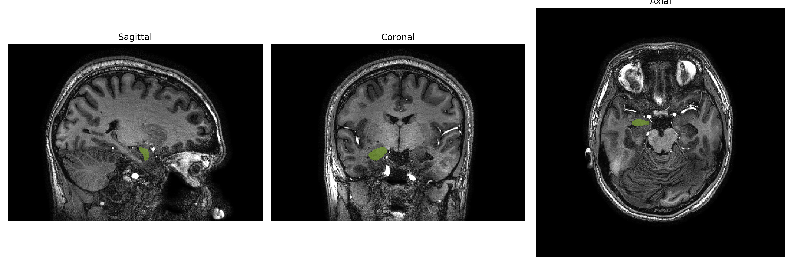
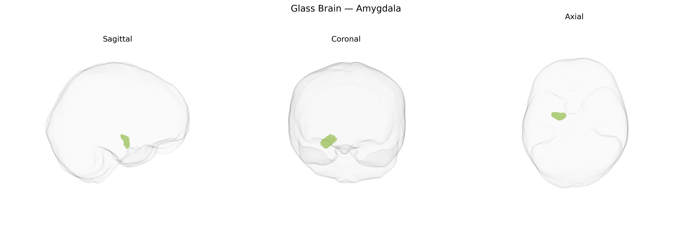

# Amygdala
 
## Overview
 
The **Right Amygdala** is one of a pair of almond-shaped nuclei located deep within the medial temporal lobe, forming a key component of the limbic system. It is heavily interconnected with the prefrontal cortex, hippocampus, hypothalamus, and sensory association areas, and is particularly implicated in processing emotional stimuli, especially fear, threat detection, and negative affect, with a tendency toward rapid, coarse evaluation of salient environmental cues. The right amygdala contributes to autonomic and endocrine responses via projections to hypothalamic and brainstem centers, modulates memory consolidation for emotionally charged events through interactions with the hippocampal formation, and participates in social cognition, including the interpretation of facial expressions and social signals. Functional asymmetry with the left amygdala has been reported, with the right often associated with more immediate, nonverbal emotional responses.  

[Right Amygdala](https://en.wikipedia.org/wiki/Amygdala)
 
The right amygdala, as defined in the brainCOLOR Atlas, has been implicated in multiple genetic association studies, particularly GWAS of amygdala volume and function, although most large-scale imaging genetics consortia (e.g., ENIGMA) typically analyze bilateral or total amygdala measures rather than strictly unilateral regions. Common variants in or near genes such as SLC6A4 (serotonin transporter), BDNF (notably the Val66Met polymorphism), FKBP5, and various HPA-axis–related genes have been associated with structural and functional differences in amygdala circuits, including lateralized effects involving the right amygdala in some cohorts. Polygenic risk scores for major depression, anxiety disorders, and schizophrenia have been linked to altered amygdala volume or reactivity, and several studies report that risk alleles for PTSD, social anxiety, and neuroticism are related to heightened right amygdala activation to threat-related stimuli. Additionally, GWAS of subcortical brain volumes have identified loci (e.g., near HRK, SEMA3A, and other neurodevelopmental or synaptic genes) that influence amygdala size, though lateralized (right-specific) effects are less consistently reported and often emerge in post hoc or region-of-interest analyses rather than as primary GWAS targets. Overall, genetic findings converge on pathways involved in synaptic plasticity, stress responsivity, and emotional regulation, which modulate right amygdala structure and reactivity and contribute to vulnerability for mood and anxiety disorders, PTSD, and related affective traits.
 
*Overview generated by GPT-4o (2026).*
 
---
 
**Region ID:** 3  
**Hemisphere:** Right  
**Atlas:** brainCOLOR 
 
---
 
## Amygdala – Black Background (Full Brain)
 

 
**Full Quality Version:** <a href="full_black.mp4" download>Download MP4</a>
 
---
 
## Amygdala – White Background (Full Brain)
 

 
**Full Quality Version:** <a href="full_white.mp4" download>Download MP4</a>
 
---

## Amygdala – Black Background (Hemisphere)
 

 
**Full Quality Version:** <a href="hemi_black.mp4" download>Download MP4</a>
 
---
 
## Amygdala – White Background (Hemisphere)
 

 
**Full Quality Version:** <a href="hemi_white.mp4" download>Download MP4</a>
 
---

## Triplanar View – T1 Background
 

 
---
 
## Triplanar View – Ghost Brain
 


