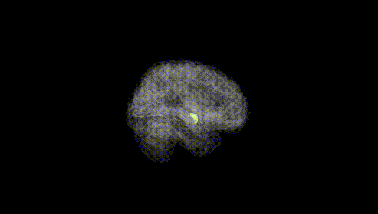
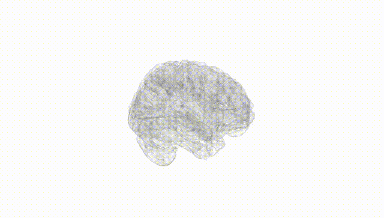
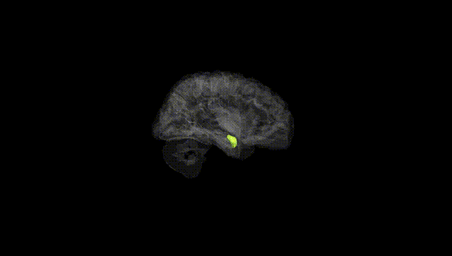
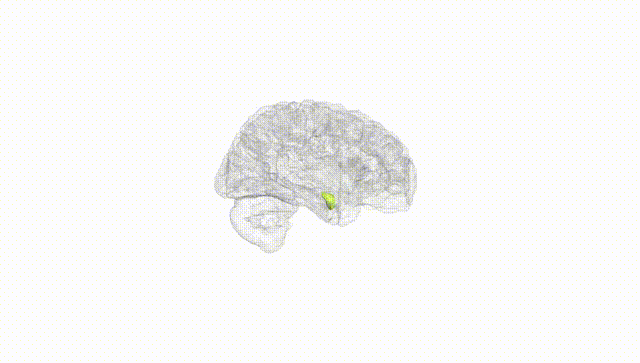
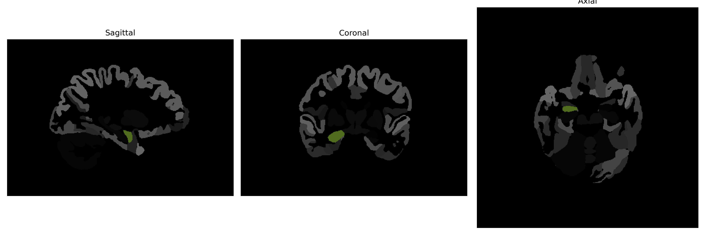

# Amygdala

## Overview

The right amygdala is a key component of the brain's limbic system, located deep within the temporal lobe. It is involved in processing emotions, particularly those related to fear and pleasure, and plays a crucial role in the formation and storage of emotional memories. The right amygdala is also involved in decision-making processes that are influenced by emotional stimuli. Structurally, it is an almond-shaped cluster of nuclei that communicates with both cortical and subcortical regions to integrate and coordinate emotional responses. Its function can be asymmetric, often showing differing patterns of activity compared to the left amygdala, especially in tasks related to emotional processing and memory encoding.

There is no direct Wikipedia link specifically for the right amygdala as described in the brainCOLOR Atlas. However, more information about the amygdala in general can be found here: https://en.wikipedia.org/wiki/Amygdala

*Overview generated by GPT-4o (2026).*

---

**Region ID:** 3  
**Hemisphere:** Right  
**Atlas:** brainCOLOR 

---

## Full Brain – Black Background

**Full Quality Version:** [Download MP4](full_black.mp4)

---

## Full Brain – White Background

**Full Quality Version:** [Download MP4](full_white.mp4)

---

## Hemisphere Only – Black Background

**Full Quality Version:** [Download MP4](hemi_black.mp4)

---

## Hemisphere Only – White Background

**Full Quality Version:** [Download MP4](hemi_white.mp4)

---

## Triplanar View (Centered on ROI)

