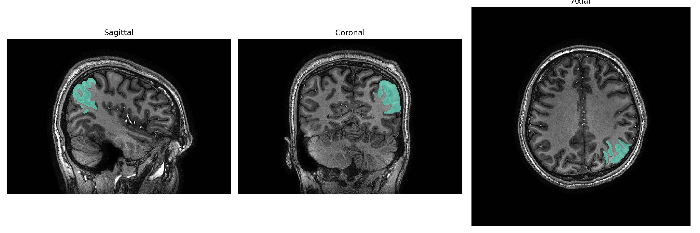
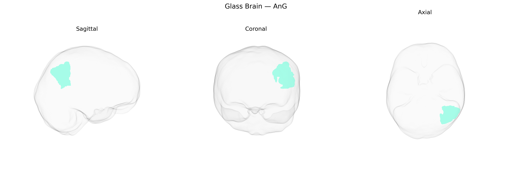

# AnG
 
## Overview
 
The Left AnG (left angular gyrus) is a cortical region located in the posterior part of the inferior parietal lobule, bordering the temporal and occipital lobes, and is typically associated with Brodmann area 39. It plays key roles in language processing (including reading, writing, and semantic integration), number processing, spatial cognition, theory of mind, and aspects of memory retrieval. The angular gyrus is a heteromodal association area that integrates multisensory inputs (visual, auditory, and somatosensory) to support higher-order cognitive functions such as metaphor comprehension and complex linguistic operations. It is supplied mainly by branches of the middle cerebral artery and exhibits strong connectivity with frontal, temporal, and occipital association cortices as well as with key nodes of the default mode network. [Angular gyrus](https://en.wikipedia.org/wiki/Angular_gyrus)
 
The left angular gyrus (Left AnG) in the brainCOLOR atlas corresponds approximately to the classical left inferior parietal/angular gyrus region, for which imaging genetics and GWAS studies have identified several associations, although most work targets broader parietal or temporoparietal areas rather than this atlas label specifically. Variants in APOE (particularly ε4) and CLU have been linked to reduced volume, cortical thinning, or hypometabolism in left angular/inferior parietal regions in Alzheimer’s disease and mild cognitive impairment cohorts; these same regions show genetically influenced vulnerability to amyloid and tau load. Several large-scale neuroimaging GWAS (e.g., ENIGMA consortia) report heritable variation in parietal cortical thickness and surface area influenced by loci near HMGA2, IGF1, and other neurodevelopmental and growth-factor genes, though their effects are not unique to the angular gyrus. Polygenic risk scores for schizophrenia, bipolar disorder, and major depression have been associated with structural and functional alterations in left angular/inferior parietal cortex, including volume loss and abnormal task-related activation in language and default mode network tasks. In autism spectrum disorder and attention-deficit/hyperactivity disorder, risk variants and polygenic burden have been linked to altered connectivity between left angular gyrus, temporal cortex, and medial prefrontal areas, consistent with its role in language, social cognition, and attentional reorienting. Additionally, candidate gene and polygenic studies of reading disability, dyslexia, and mathematical ability implicate left temporoparietal and angular regions in phonological processing and numerical cognition, with genes such as DCDC2, KIAA0319, and ROBO1 associated with structural or functional differences in nearby parietotemporal cortex, though direct GWAS hits strictly localized to the Left AnG label of the brainCOLOR atlas have not yet been clearly delineated in the literature.
 
*Overview generated by GPT-4o (2026).*
 
---
 
**Region ID:** 31  
**Hemisphere:** Left  
**Atlas:** brainCOLOR 
 
---
 
## AnG – Black Background (Full Brain)
 

 
**Full Quality Version:** <a href="full_black.mp4" download>Download MP4</a>
 
---
 
## AnG – White Background (Full Brain)
 

 
**Full Quality Version:** <a href="full_white.mp4" download>Download MP4</a>
 
---

## AnG – Black Background (Hemisphere)
 

 
**Full Quality Version:** <a href="hemi_black.mp4" download>Download MP4</a>
 
---
 
## AnG – White Background (Hemisphere)
 

 
**Full Quality Version:** <a href="hemi_white.mp4" download>Download MP4</a>
 
---

## Triplanar View – T1 Background
 

 
---
 
## Triplanar View – Ghost Brain
 


