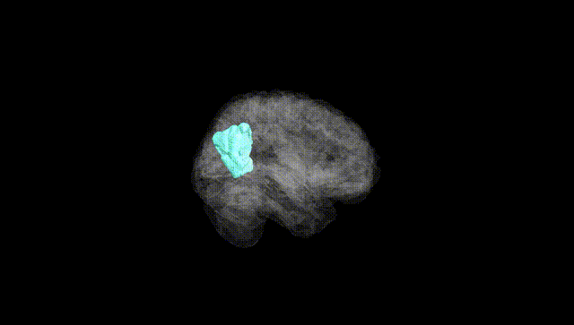
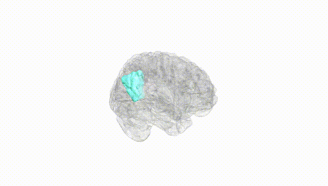
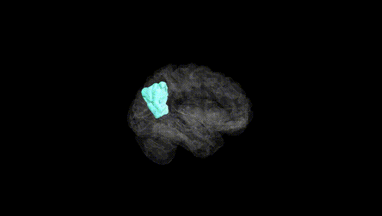
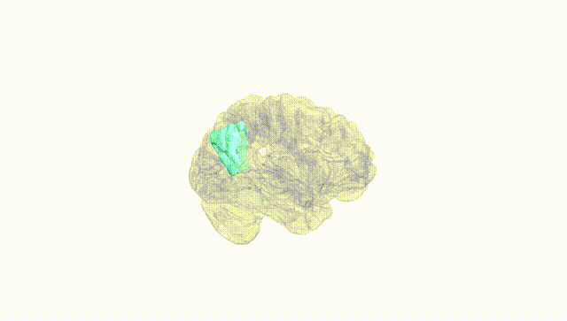
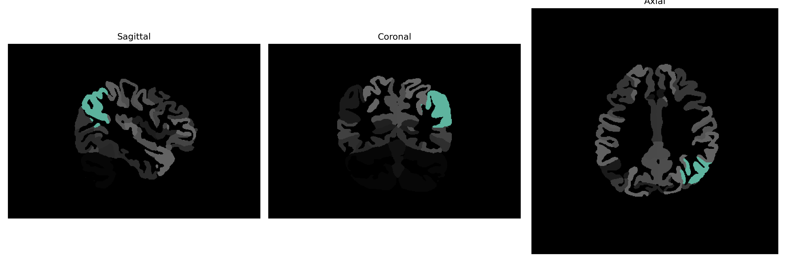

# AnG

## Overview

The Left Angular Gyrus (Left AnG) is located in the parietal lobe of the brain, specifically at the parietotemporal junction, and plays a crucial role in various high-level cognitive functions. It is associated with processes such as language, number processing, memory retrieval, attention, and theory of mind. The Left AnG is thought to act as a cross-modal hub, integrating information from different sensory modalities and cognitive tasks. This integration aids in comprehension, abstract thinking, and the generation of novel ideas. Anatomically, it is situated in Brodmann area 39 and receives input from a diverse array of brain regions, further emphasizing its role in complex cognitive processes.

There is no direct link to a description of the Left AnG in the brainCOLOR Atlas on Wikipedia. However, more information about its broader role can be found in the entry for the Angular Gyrus: https://en.wikipedia.org/wiki/Angular_gyrus

*Overview generated by GPT-4o (2026).*

---

**Region ID:** 31  
**Hemisphere:** Left  
**Atlas:** brainCOLOR 

---

## Full Brain – Black Background

**Full Quality Version:** [Download MP4](full_black.mp4)

---

## Full Brain – White Background

**Full Quality Version:** [Download MP4](full_white.mp4)

---

## Hemisphere Only – Black Background

**Full Quality Version:** [Download MP4](hemi_black.mp4)

---

## Hemisphere Only – White Background

**Full Quality Version:** [Download MP4](hemi_white.mp4)

---

## Triplanar View (Centered on ROI)

