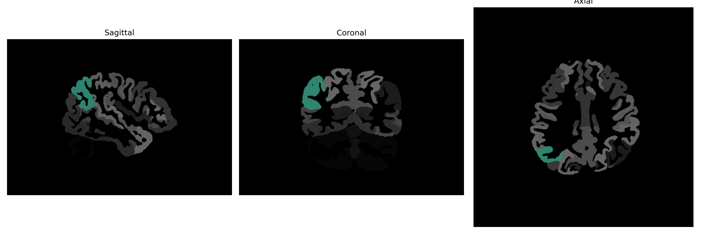

# angular-gyrus

## Overview

The right angular gyrus is a region located in the parietal lobe of the human brain. It plays a significant role in complex functions such as language processing, mathematical operations, spatial cognition, memory retrieval, and attention. Positioned at the intersection between the parietal, temporal, and occipital lobes, it acts as a crucial node integrating multisensory information from various brain regions. Its involvement extends to various cognitive processes, including interpreting metaphors, reading comprehension, and even social cognition tasks such as theory of mind. The angular gyrus integrates these diverse functions by facilitating communication between different brain parts, providing an essential link in cognitive processing and behavior.

There is no direct Wikipedia link to the right angular gyrus from the brainCOLOR Atlas, but related information can be found through the general entry for the angular gyrus: https://en.wikipedia.org/wiki/Angular_gyrus

*Overview generated by GPT-4o (2026).*

---

**Region ID:** 30  
**Hemisphere:** Right  
**Atlas:** brainCOLOR 

---

## Full Brain – Black Background

**Full Quality Version:** [Download MP4](full_black.mp4)

---

## Full Brain – White Background

**Full Quality Version:** [Download MP4](full_white.mp4)

---

## Hemisphere Only – Black Background

**Full Quality Version:** [Download MP4](hemi_black.mp4)

---

## Hemisphere Only – White Background

**Full Quality Version:** [Download MP4](hemi_white.mp4)

---

## Triplanar View (Centered on ROI)

