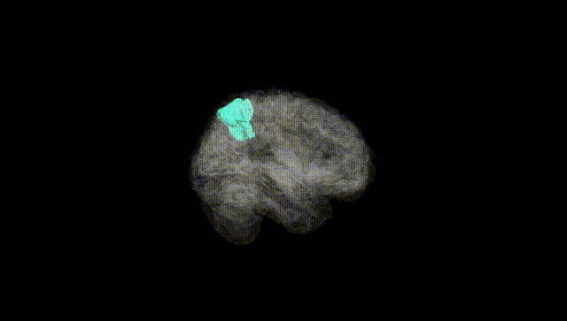
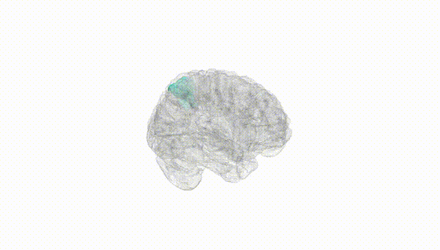
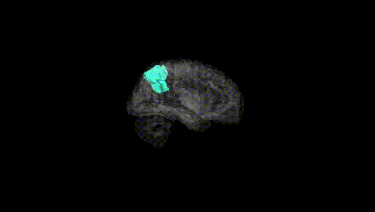
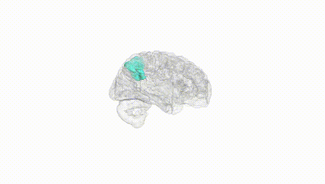
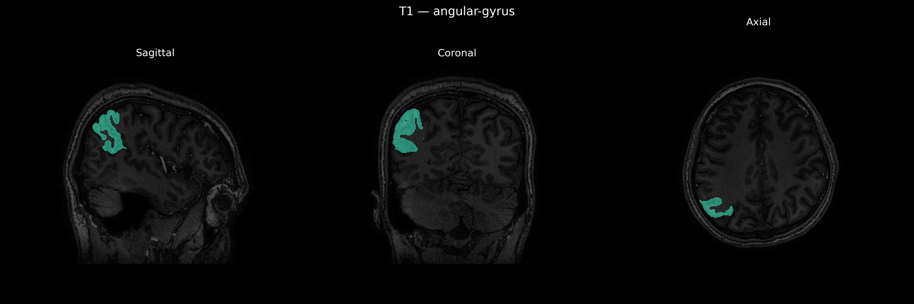
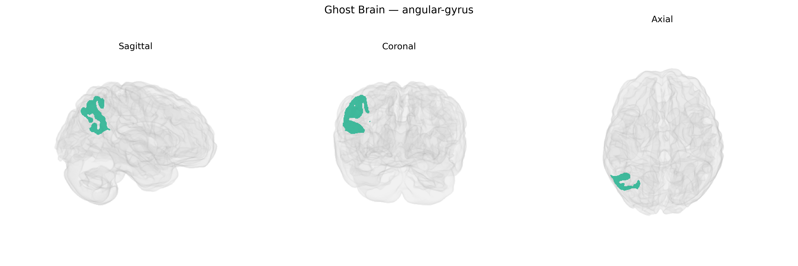

# angular-gyrus
 
## Overview
 
The right angular gyrus is a multimodal association region located in the posterior part of the inferior parietal lobule, bordering the temporal and occipital lobes. It integrates visual, auditory, and somatosensory information and is implicated in higher cognitive functions including language processing (particularly semantic and metaphor comprehension), number processing and arithmetic, spatial attention, and aspects of social cognition such as theory of mind. Functionally, the right angular gyrus has been associated with reorienting attention to salient stimuli, integrating contextual information, and supporting processes related to self–other distinction and embodiment. Damage or dysfunction in this area can contribute to deficits such as hemispatial neglect, impaired visuospatial processing, and disturbances in body awareness. There is no direct Wikipedia article for the “Right angular-gyrus” as a distinct entity; a related and encompassing entry is [Angular gyrus](https://en.wikipedia.org/wiki/Angular_gyrus).
 
The right angular gyrus, as defined in the brainCOLOR atlas, has been implicated in several genetically informed imaging and clinical studies, although few associations are highly region-specific. Imaging GWAS of cortical thickness and surface area (e.g., ENIGMA, UK Biobank) have reported common variants near genes involved in neurodevelopment and synaptic function (such as MIR137, MAPT, and genes in glutamatergic pathways) that influence morphology in inferior parietal and angular gyrus regions, often as part of broader parietal or temporoparietal clusters rather than isolated right-angular-gyrus effects. Polygenic risk for schizophrenia, major depressive disorder, autism spectrum disorder, and attention-deficit/hyperactivity disorder has been associated with structural and functional alterations in the angular gyrus within large-scale network analyses, including the default mode and language networks. Rare variant and copy-number studies in neurodevelopmental and language-related disorders (e.g., dyslexia, specific language impairment, and broader learning disabilities) frequently highlight genes governing cortical patterning and axonal connectivity that show altered structure or activation in temporoparietal areas encompassing the right angular gyrus. Additionally, GWAS of cognitive traits such as general intelligence, numeracy, reading ability, and semantic processing identify genetic loci that modulate activation and connectivity of the angular gyrus during language, arithmetic, and theory-of-mind tasks, again typically at the network or lobar level rather than through variants uniquely tied to this single right-hemisphere parcel.
 
*Overview generated by GPT-4o (2026).*
 
---
 
**Region ID:** 30  
**Hemisphere:** Right  
**Atlas:** brainCOLOR 
 
---
 
## angular-gyrus – Black Background (Full Brain)
 

 
**Full Quality Version:** <a href="full_black.mp4" download>Download MP4</a>
 
---
 
## angular-gyrus – White Background (Full Brain)
 

 
**Full Quality Version:** <a href="full_white.mp4" download>Download MP4</a>
 
---

## angular-gyrus – Black Background (Hemisphere)
 

 
**Full Quality Version:** <a href="hemi_black.mp4" download>Download MP4</a>
 
---
 
## angular-gyrus – White Background (Hemisphere)
 

 
**Full Quality Version:** <a href="hemi_white.mp4" download>Download MP4</a>
 
---

## Triplanar View – T1 Background
 

 
---
 
## Triplanar View – Ghost Brain
 


