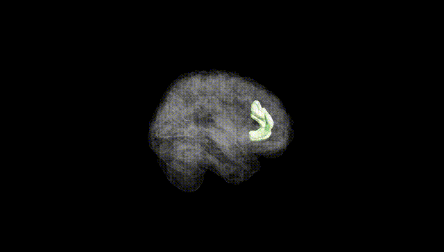
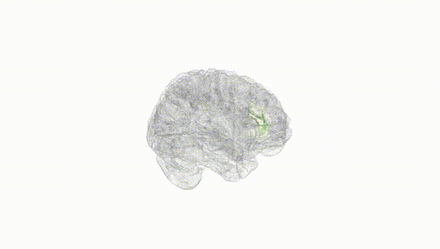
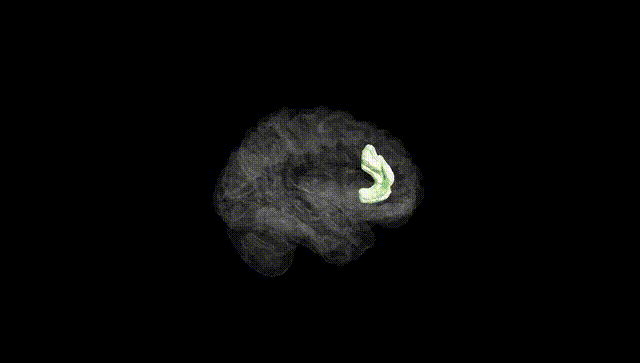
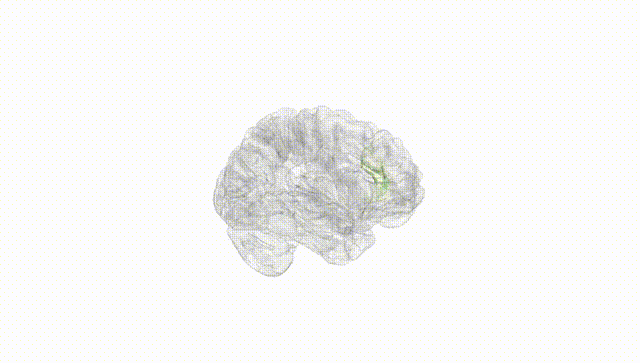
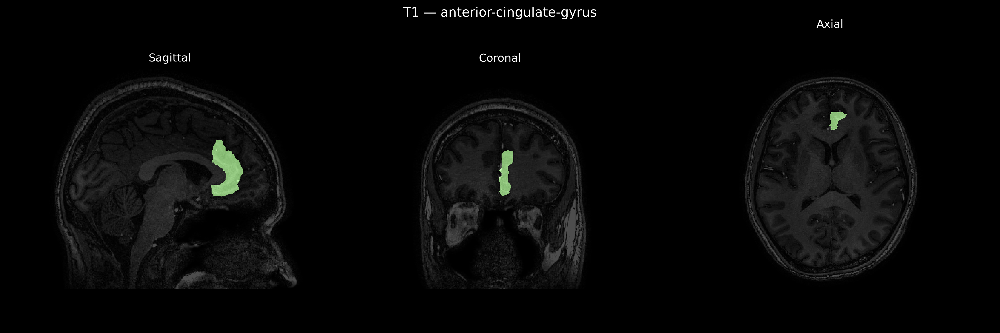
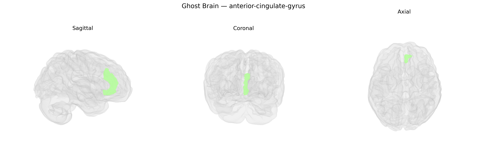

# anterior-cingulate-gyrus

## Overview

The left anterior cingulate gyrus is the rostral portion of the cingulate cortex located on the medial surface of the left cerebral hemisphere, arching above the corpus callosum and anterior to the vertical plane through the genu. It forms part of the limbic system and is involved in integration of cognitive, emotional, and autonomic processes, including error monitoring, conflict detection, affect regulation, and modulation of autonomic responses via extensive connections with prefrontal, limbic, and subcortical structures. Cytoarchitectonically, it corresponds largely to agranular and dysgranular areas of the anterior cingulate cortex (e.g., Brodmann areas 24/32), and in the brainCOLOR Atlas it is parcellated as a distinct left-hemispheric gyral region within the cingulate gyrus. There is no direct Wikipedia page specifically for the “Left anterior-cingulate-gyrus” as defined in the brainCOLOR Atlas; a closely related structure with detailed information is the anterior cingulate cortex: https://en.wikipedia.org/wiki/Anterior_cingulate_cortex

*Overview generated by GPT-4o (2026).*

---

**Region ID:** 25  
**Hemisphere:** Left  
**Atlas:** brainCOLOR 

---

## Full Brain – Black Background

**Full Quality Version:** [Download MP4](full_black.mp4)

---

## Full Brain – White Background

**Full Quality Version:** [Download MP4](full_white.mp4)

---

## Hemisphere Only – Black Background

**Full Quality Version:** [Download MP4](hemi_black.mp4)

---

## Hemisphere Only – White Background

**Full Quality Version:** [Download MP4](hemi_white.mp4)

---

## Triplanar View – T1 Background

---

## Triplanar View – Ghost Brain


