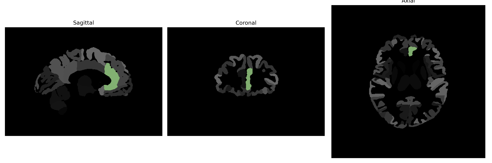

# anterior-cingulate-gyrus

## Overview

The left anterior cingulate gyrus is a region in the brain that plays a crucial role in a variety of cognitive and emotional processes, including decision-making, emotional regulation, and impulse control. Positioned in the frontal part of the cingulate cortex, this structure is part of the limbic system and is involved in the integration of cognitive and affective information. The anterior cingulate gyrus is also associated with autonomic functions such as regulating blood pressure and heart rate. Its activity is linked to motivation and emotion regulation, and it is studied extensively for its role in psychological conditions such as depression and anxiety disorders. This structure facilitates communication between the limbic system and the prefrontal cortex, thus playing a significant part in executive function and social behavior.

There is no direct Wikipedia link specifically for the left anterior cingulate gyrus, but the page for the cingulate cortex provides relevant information: [Cingulate cortex - Wikipedia](https://en.wikipedia.org/wiki/Cingulate_cortex).

*Overview generated by GPT-4o (2026).*

---

**Region ID:** 25  
**Hemisphere:** Left  
**Atlas:** brainCOLOR 

---

## Full Brain – Black Background

**Full Quality Version:** [Download MP4](full_black.mp4)

---

## Full Brain – White Background

**Full Quality Version:** [Download MP4](full_white.mp4)

---

## Hemisphere Only – Black Background

**Full Quality Version:** [Download MP4](hemi_black.mp4)

---

## Hemisphere Only – White Background

**Full Quality Version:** [Download MP4](hemi_white.mp4)

---

## Triplanar View (Centered on ROI)

