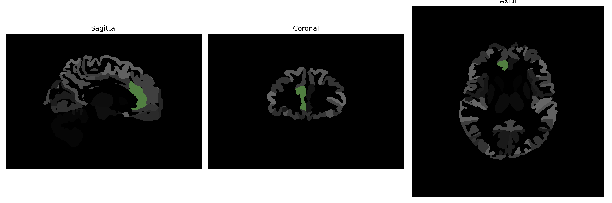

# anterior-cingulate-gyrus

## Overview

The right anterior cingulate gyrus is a component of the cingulate cortex located in the medial aspect of the brain's right hemisphere. It forms a part of the limbic lobe and plays a crucial role in various complex cognitive functions, including emotion formation and processing, learning, and memory. This region is associated with the regulation of autonomic functions, decision-making, and empathy. The anterior cingulate gyrus is positioned superior to the corpus callosum and is involved in integrating cognitive operations with emotional responses, thus contributing to behavioral and motivational outcomes.

There is no direct link to a specific Wikipedia page for the right anterior cingulate gyrus alone. However, a related page that includes information about this structure is available: [Cingulate cortex - Wikipedia](https://en.wikipedia.org/wiki/Cingulate_cortex).

*Overview generated by GPT-4o (2026).*

---

**Region ID:** 24  
**Hemisphere:** Right  
**Atlas:** brainCOLOR 

---

## Full Brain – Black Background

**Full Quality Version:** [Download MP4](full_black.mp4)

---

## Full Brain – White Background

**Full Quality Version:** [Download MP4](full_white.mp4)

---

## Hemisphere Only – Black Background

**Full Quality Version:** [Download MP4](hemi_black.mp4)

---

## Hemisphere Only – White Background

**Full Quality Version:** [Download MP4](hemi_white.mp4)

---

## Triplanar View (Centered on ROI)

