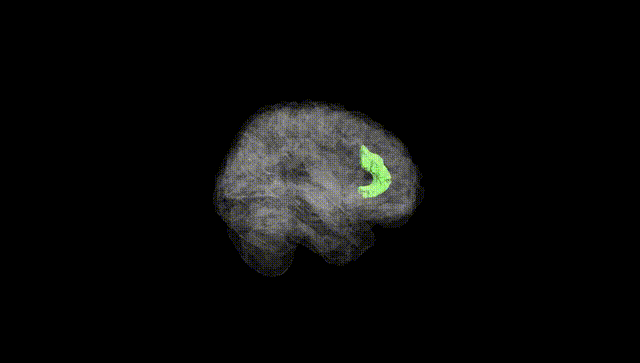
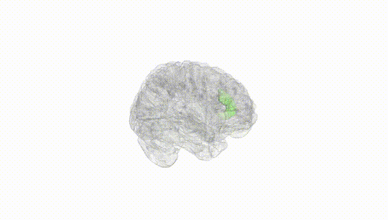
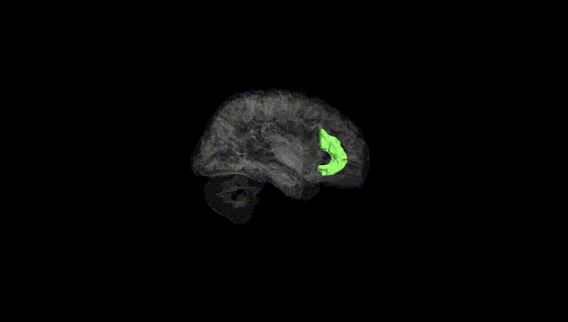
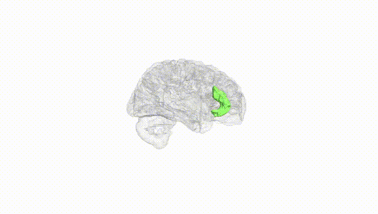
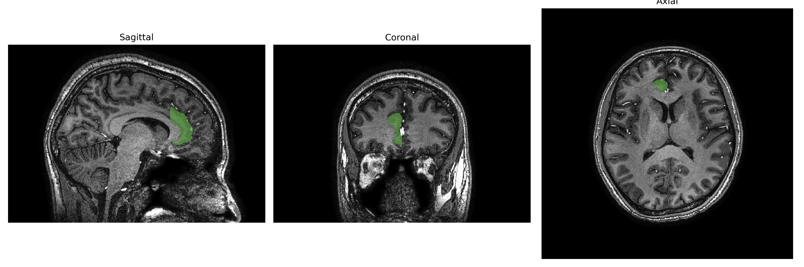
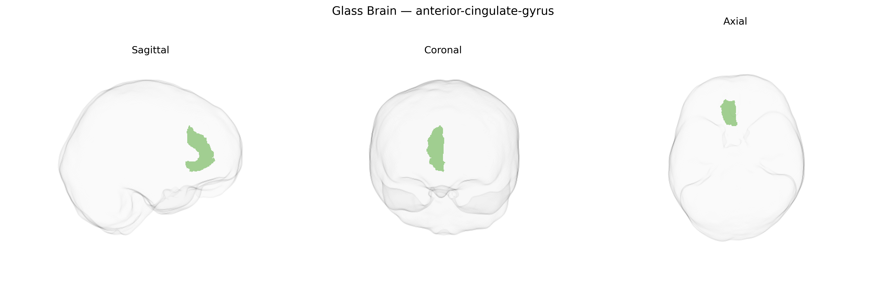

# anterior-cingulate-gyrus

## Overview

The right anterior cingulate gyrus is a medial frontal cortical region forming part of the cingulate cortex, arching above the corpus callosum and extending anteriorly toward the genu. It is implicated in executive control, error monitoring, conflict detection, emotional regulation, and autonomic modulation, integrating cognitive and affective information to guide decision-making and behavioral adaptation. Functionally, it participates in networks supporting attention, motivation, and the evaluation of salient stimuli, and shows strong connectivity with prefrontal, limbic, and insular regions. In the brainCOLOR Atlas, this region is defined as a specific right-hemispheric parcel within the anterior portion of the cingulate gyrus, distinguished from more posterior cingulate and midcingulate subdivisions by its cytoarchitecture and connectivity profiles. There is no direct Wikipedia link for the “Right anterior-cingulate-gyrus” as defined in the brainCOLOR Atlas; a closely related entry is the general anterior cingulate cortex: https://en.wikipedia.org/wiki/Anterior_cingulate_cortex

*Overview generated by GPT-4o (2026).*

---

**Region ID:** 24  
**Hemisphere:** Right  
**Atlas:** brainCOLOR 

---

## anterior-cingulate-gyrus – Black Background (Full Brain)

**Full Quality Version:** [Download MP4](full_black.mp4)

---

## anterior-cingulate-gyrus – White Background (Full Brain)

**Full Quality Version:** [Download MP4](full_white.mp4)

---

## anterior-cingulate-gyrus – Black Background (Hemisphere)

**Full Quality Version:** [Download MP4](hemi_black.mp4)

---

## anterior-cingulate-gyrus – White Background (Hemisphere)

**Full Quality Version:** [Download MP4](hemi_white.mp4)

---

## Triplanar View – T1 Background

---

## Triplanar View – Ghost Brain


