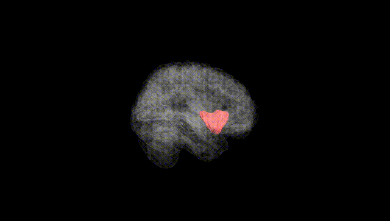
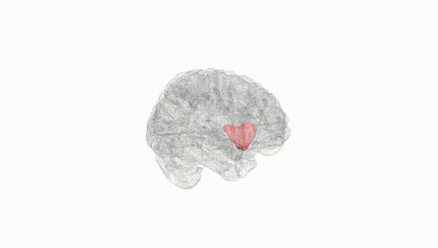
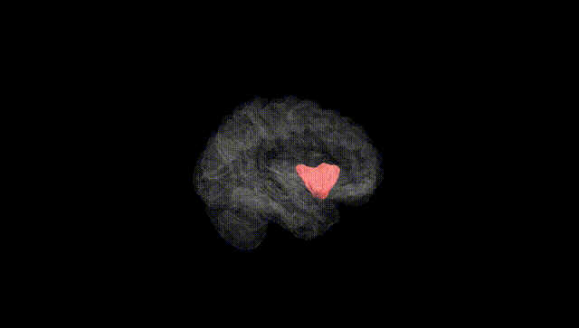
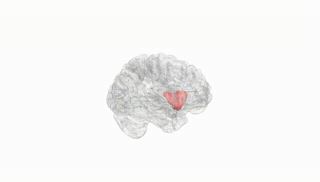
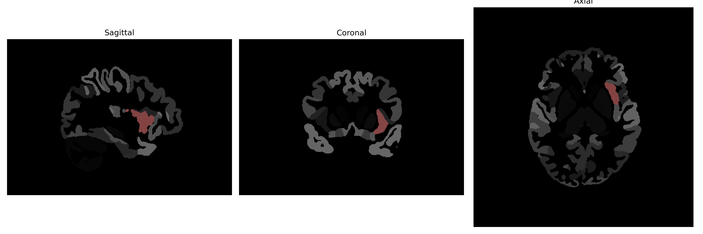

# anterior-insula

## Overview

The left anterior-insula is a subregion of the insular cortex, which is situated deep within the lateral sulcus of the brain. Functionally, the left anterior-insula is involved in a variety of cognitive and sensory processes, including emotional awareness, subjective emotional experience, and interoception—the sense of the physiological state of the body. This region has been implicated in integrating sensory information with emotions and is considered a hub for processing and interpreting the emotional significance of events. Neuroimaging studies often reveal this area as being activated during tasks that require emotional self-awareness and empathy. The insula, including the anterior region, is highly connected with other parts of the brain, supporting complex neural processes.

There is no direct link to a specific description of the left anterior-insula; however, more information about the insular cortex can be found here: [Insular Cortex on Wikipedia](https://en.wikipedia.org/wiki/Insular_cortex).

*Overview generated by GPT-4o (2026).*

---

**Region ID:** 27  
**Hemisphere:** Left  
**Atlas:** brainCOLOR 

---

## Full Brain – Black Background

**Full Quality Version:** [Download MP4](full_black.mp4)

---

## Full Brain – White Background

**Full Quality Version:** [Download MP4](full_white.mp4)

---

## Hemisphere Only – Black Background

**Full Quality Version:** [Download MP4](hemi_black.mp4)

---

## Hemisphere Only – White Background

**Full Quality Version:** [Download MP4](hemi_white.mp4)

---

## Triplanar View (Centered on ROI)

