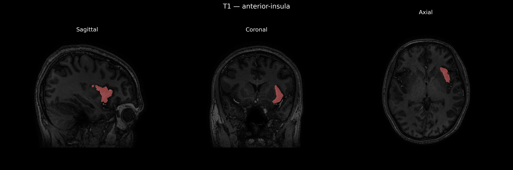
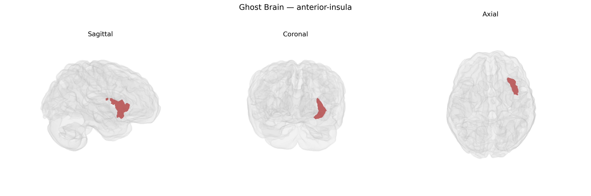

# anterior-insula

## Overview

The left anterior insula is the rostral portion of the insular cortex located deep within the lateral sulcus of the left cerebral hemisphere, overlaid by the frontal, parietal, and temporal opercula. Cytoarchitectonically, it contains agranular and dysgranular cortices that differ from the more granular posterior insula and is interconnected with the anterior cingulate cortex, frontal operculum, orbitofrontal cortex, limbic structures (including amygdala), and subcortical autonomic centers. Functionally, the left anterior insula is implicated in interoceptive awareness, integration of visceral and emotional states, subjective feeling states, language-related processes (particularly speech production and articulation in the dominant hemisphere), and higher-order cognitive control within the salience network. In the brainCOLOR Atlas, it is delineated as a distinct region within the insular lobe based on its anatomical position and connectivity profiles rather than on gross surface landmarks alone. There is no direct Wikipedia page for the “Left anterior-insula” as labeled in the brainCOLOR Atlas; a related and encompassing structure is the “Insular cortex”: https://en.wikipedia.org/wiki/Insular_cortex.

*Overview generated by GPT-4o (2026).*

---

**Region ID:** 27  
**Hemisphere:** Left  
**Atlas:** brainCOLOR 

---

## Full Brain – Black Background

**Full Quality Version:** [Download MP4](full_black.mp4)

---

## Full Brain – White Background

**Full Quality Version:** [Download MP4](full_white.mp4)

---

## Hemisphere Only – Black Background

**Full Quality Version:** [Download MP4](hemi_black.mp4)

---

## Hemisphere Only – White Background

**Full Quality Version:** [Download MP4](hemi_white.mp4)

---

## Triplanar View – T1 Background

---

## Triplanar View – Ghost Brain


