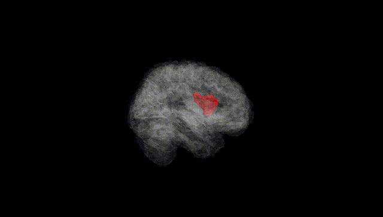
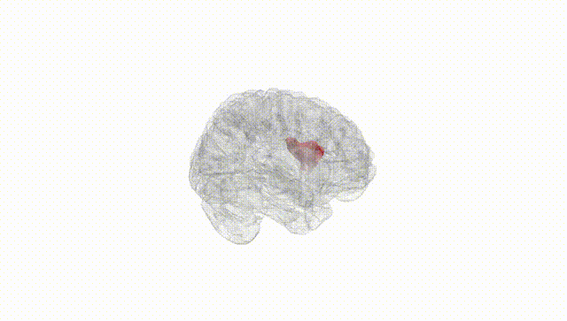
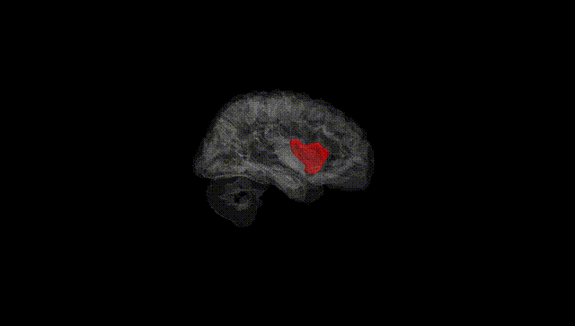
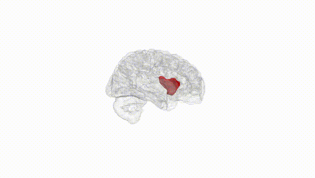
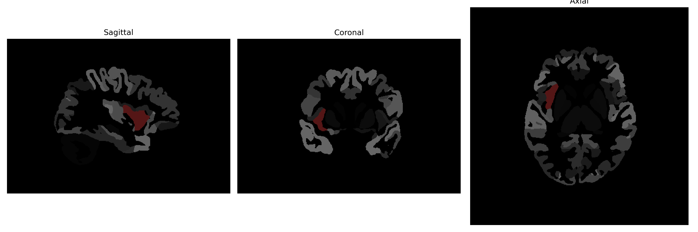

# anterior-insula

## Overview

The right anterior-insula is a subregion of the insular cortex situated in the cerebrum, playing a crucial role in diverse cognitive processes. It is implicated in interoceptive awareness, emotion regulation, and the integration of sensory and affective information. This region facilitates the perception of internal bodily states, contributing to feelings such as empathy and social cognition. Structurally, the anterior insula is distinguished from the posterior insula by its cytoarchitecture and functional connectivity. It is involved in the salience network, participating actively in detecting and filtering biologically relevant stimuli. Neuroimaging studies highlight its involvement in processing pain and various emotional states, as well as in the conscious awareness of physiological changes. The right anterior-insula is often studied in association with psychiatric conditions due to its integral role in emotional and self-awareness processes. 

There is no direct Wikipedia link exclusively for the right anterior-insula. However, a relevant link to the insular cortex, which contains this subregion, can be found at: https://en.wikipedia.org/wiki/Insular_cortex

*Overview generated by GPT-4o (2026).*

---

**Region ID:** 26  
**Hemisphere:** Right  
**Atlas:** brainCOLOR 

---

## Full Brain – Black Background

**Full Quality Version:** [Download MP4](full_black.mp4)

---

## Full Brain – White Background

**Full Quality Version:** [Download MP4](full_white.mp4)

---

## Hemisphere Only – Black Background

**Full Quality Version:** [Download MP4](hemi_black.mp4)

---

## Hemisphere Only – White Background

**Full Quality Version:** [Download MP4](hemi_white.mp4)

---

## Triplanar View (Centered on ROI)

