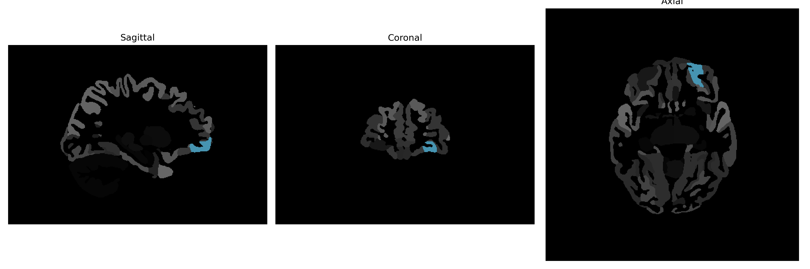

# anterior-orbital-gyrus

## Overview

The Left Anterior Orbital Gyrus is a cortical structure located within the frontal lobe of the brain. It is part of the prefrontal cortex, specifically positioned ventrally and anteriorly in relation to other regions in the frontal lobe. This gyrus plays a pivotal role in decision-making, social behavior, and the modulation of emotion, integrating complex cognitive processes with affective responses. As it belongs to the orbitofrontal cortex, it contributes to evaluating rewards and punishments, which is essential for adaptive behavior. Given its integrative functions, the Left Anterior Orbital Gyrus is often studied in the context of psychiatric and neurobehavioral disorders.

There is no direct Wikipedia link for the Left Anterior Orbital Gyrus. However, a related entry can be found under the orbitofrontal cortex: https://en.wikipedia.org/wiki/Orbitofrontal_cortex

*Overview generated by GPT-4o (2026).*

---

**Region ID:** 29  
**Hemisphere:** Left  
**Atlas:** brainCOLOR 

---

## Full Brain – Black Background

**Full Quality Version:** [Download MP4](full_black.mp4)

---

## Full Brain – White Background

**Full Quality Version:** [Download MP4](full_white.mp4)

---

## Hemisphere Only – Black Background

**Full Quality Version:** [Download MP4](hemi_black.mp4)

---

## Hemisphere Only – White Background

**Full Quality Version:** [Download MP4](hemi_white.mp4)

---

## Triplanar View (Centered on ROI)

