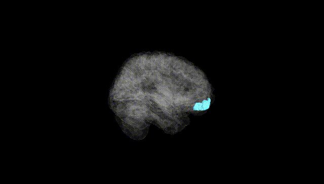
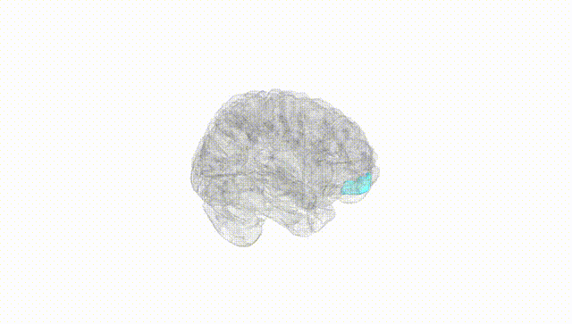
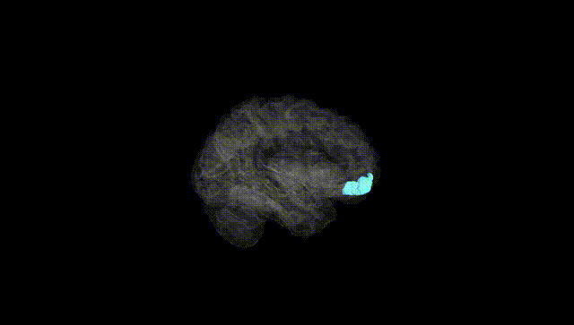
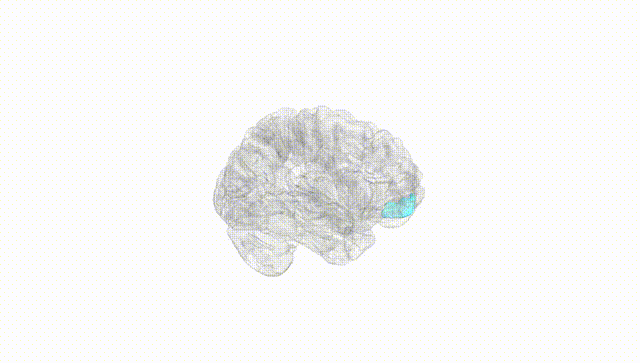
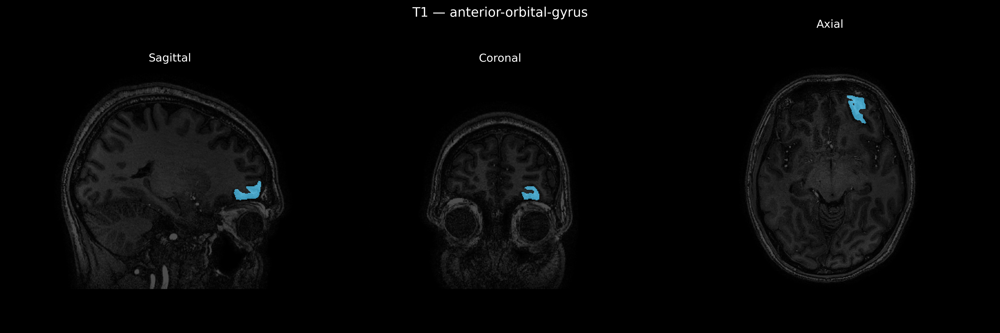
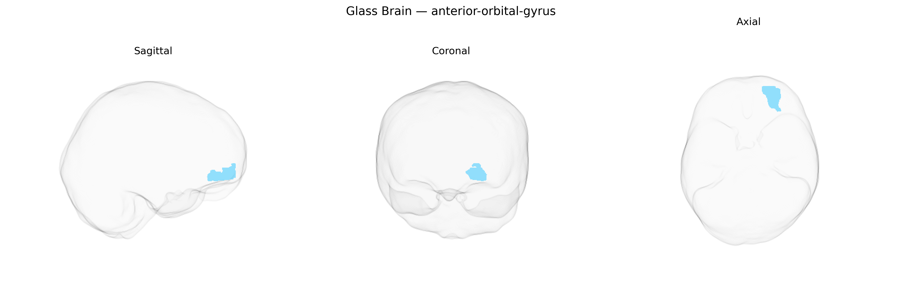

# anterior-orbital-gyrus
 
## Overview
 
The left anterior orbital gyrus is a ventral prefrontal cortical region located on the orbital (inferior) surface of the frontal lobe, anterior to other orbital gyri and overlying the orbital plate of the frontal bone. It forms part of the orbitofrontal cortex, a multimodal association area extensively interconnected with limbic structures (including the amygdala and hippocampus), sensory association cortices, and subcortical nuclei. Functionally, this region contributes to reward valuation, affective decision-making, emotional regulation, and the integration of sensory information with internal states to guide goal-directed behavior and social cognition. Lesions or dysfunction in the anterior orbital regions have been implicated in impaired judgment, disinhibition, altered risk–reward evaluation, and changes in personality and mood. There is no direct link; for a related structure, see [Orbitofrontal cortex](https://en.wikipedia.org/wiki/Orbitofrontal_cortex).
 
The left anterior orbital gyrus, part of the orbitofrontal cortex as defined in the brainCOLOR atlas, is implicated in genetic studies primarily through its roles in reward valuation, emotion, and decision-making rather than via region-specific loci uniquely assigned to it. Genome-wide association studies (GWAS) of cortical morphology (e.g., ENIGMA and UK Biobank) have identified common variants in genes involved in neurodevelopment and synaptic function (such as HMGA2, IGF1, and genes in Wnt and MAPK pathways) that influence orbitofrontal surface area and thickness, with some lateralized effects including the left orbital frontal regions, though not always isolating the anterior orbital gyrus specifically. Polygenic risk scores for major depressive disorder, bipolar disorder, schizophrenia, and substance use disorders show associations with structural or functional alterations in the orbitofrontal cortex, including reduced volume or altered activation in anterior orbital sectors. In addition, variants in genes related to dopaminergic and serotonergic signaling (e.g., in DRD2, SLC6A4) and in glutamatergic pathways have been indirectly linked to orbitofrontal function via imaging genetics studies that report altered reward processing, impulsivity, and decision-making correlating with orbital frontal activation patterns. Overall, current genetic evidence points to a polygenic, distributed influence on the left anterior orbital gyrus that is shared with broader prefrontal and limbic networks involved in mood, addiction, and cognitive control, rather than to a set of region-exclusive genetic risk factors.
 
*Overview generated by GPT-4o (2026).*
 
---
 
**Region ID:** 29  
**Hemisphere:** Left  
**Atlas:** brainCOLOR 
 
---
 
## anterior-orbital-gyrus – Black Background (Full Brain)
 

 
**Full Quality Version:** <a href="full_black.mp4" download>Download MP4</a>
 
---
 
## anterior-orbital-gyrus – White Background (Full Brain)
 

 
**Full Quality Version:** <a href="full_white.mp4" download>Download MP4</a>
 
---

## anterior-orbital-gyrus – Black Background (Hemisphere)
 

 
**Full Quality Version:** <a href="hemi_black.mp4" download>Download MP4</a>
 
---
 
## anterior-orbital-gyrus – White Background (Hemisphere)
 

 
**Full Quality Version:** <a href="hemi_white.mp4" download>Download MP4</a>
 
---

## Triplanar View – T1 Background
 

 
---
 
## Triplanar View – Ghost Brain
 


