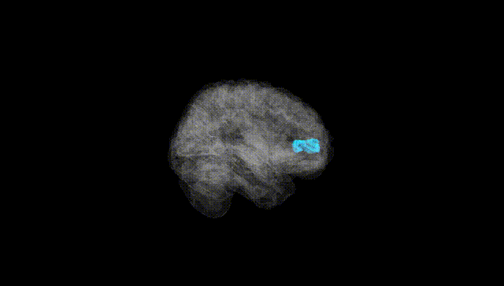
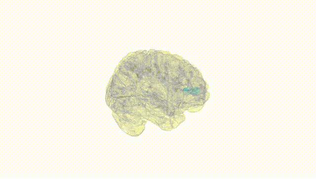
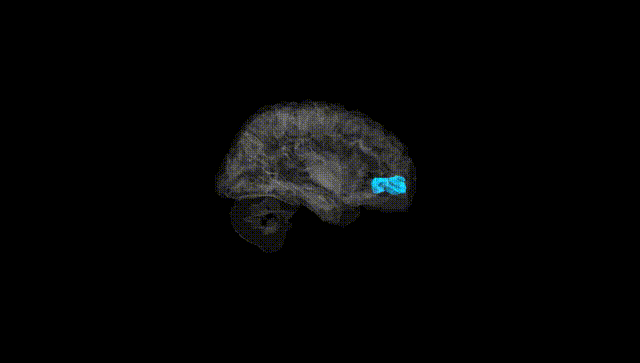
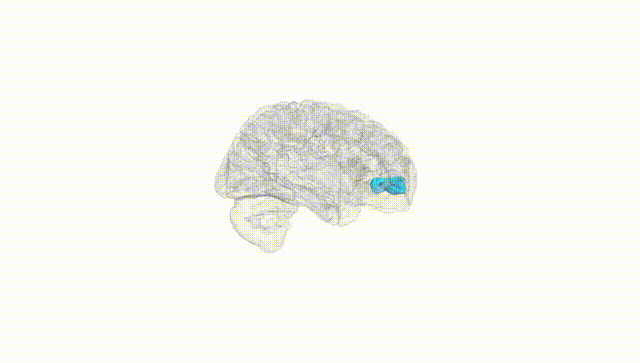
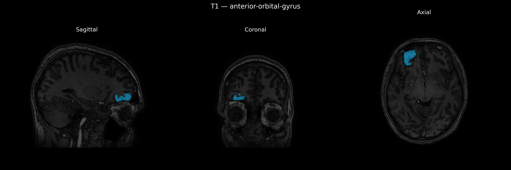
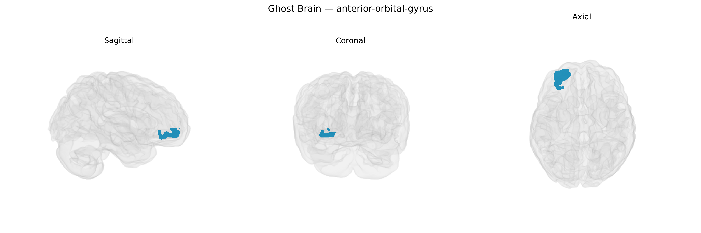

# anterior-orbital-gyrus
 
## Overview
 
The Right anterior-orbital-gyrus, as defined in the brainCOLOR atlas, corresponds to the rostral portion of the orbitofrontal cortex located on the ventral surface of the frontal lobe, directly above the orbits of the eyes. This region is involved in higher-order associative processing related to reward valuation, decision-making under uncertainty, emotional regulation, and the integration of sensory and visceral signals to guide goal-directed behavior. Cytoarchitectonically, it overlaps with areas of the orbital prefrontal cortex that receive multimodal input from limbic structures (such as the amygdala) and sensory association cortices, enabling the evaluation of stimulus salience and outcome expectations. Damage or dysfunction in this area has been associated with impaired social judgment, altered risk-reward assessment, and changes in affective responsiveness. There is no direct link for “Right anterior-orbital-gyrus”; a closely related structure is the [Orbitofrontal cortex](https://en.wikipedia.org/wiki/Orbitofrontal_cortex).
 
The right anterior orbital gyrus, part of the orbitofrontal cortex as defined in the brainCOLOR Atlas, is implicated in several genetically influenced traits and disorders through both regional and network-level findings, though few GWAS target this parcel specifically. Large neuroimaging-genetics consortia (e.g., ENIGMA, UK Biobank–based studies) have shown that cortical thickness and surface area in orbitofrontal regions, including anterior orbital segments, are moderately heritable and associated with common variants in genes related to neurodevelopment, synaptic plasticity, and neuronal migration (such as variants near HMGA2, IGF1, and genes involved in Wnt and MAPK signaling), though these associations are typically reported at lobar or orbitofrontal rather than fine-grained parcel resolution. GWAS of psychiatric and behavioral traits repeatedly implicate orbitofrontal circuitry: polygenic risk scores for major depressive disorder, schizophrenia, bipolar disorder, and autism spectrum disorder correlate with structural or functional alterations in orbitofrontal regions, and variants in genes like CACNA1C, DRD2, and GRIN2A show downstream effects on orbitofrontal activation during reward, decision-making, and emotional processing tasks. Moreover, orbitofrontal/anterior orbital measures have been linked to genetic risk for substance use (including alcohol and nicotine dependence), impulsivity, and risk-taking, often mediated by dopaminergic and glutamatergic pathways. In neurodegenerative conditions, genetic variants in APOE and other Alzheimer’s disease–related loci associate with atrophy patterns that include orbitofrontal/anterior orbital regions, while frontotemporal dementia–related genes (e.g., MAPT, GRN, C9orf72) are tied to ventral frontal involvement that can encompass the anterior orbital gyrus. Overall, the right anterior orbital gyrus emerges as a genetically influenced node in circuits supporting affect regulation, reward valuation, and social/decision processes, with risk loci for multiple psychiatric, behavioral, and neurodegenerative phenotypes converging on orbitofrontal structure and function rather than this atlas-defined region in isolation.
 
*Overview generated by GPT-4o (2026).*
 
---
 
**Region ID:** 28  
**Hemisphere:** Right  
**Atlas:** brainCOLOR 
 
---
 
## anterior-orbital-gyrus – Black Background (Full Brain)
 

 
**Full Quality Version:** <a href="full_black.mp4" download>Download MP4</a>
 
---
 
## anterior-orbital-gyrus – White Background (Full Brain)
 

 
**Full Quality Version:** <a href="full_white.mp4" download>Download MP4</a>
 
---

## anterior-orbital-gyrus – Black Background (Hemisphere)
 

 
**Full Quality Version:** <a href="hemi_black.mp4" download>Download MP4</a>
 
---
 
## anterior-orbital-gyrus – White Background (Hemisphere)
 

 
**Full Quality Version:** <a href="hemi_white.mp4" download>Download MP4</a>
 
---

## Triplanar View – T1 Background
 

 
---
 
## Triplanar View – Ghost Brain
 


