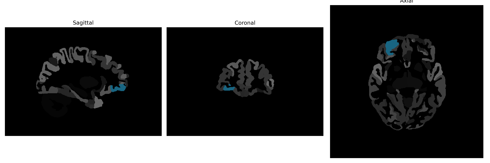

# anterior-orbital-gyrus

## Overview

The right anterior-orbital-gyrus is a region of the brain located within the frontal lobe, specifically within the orbitofrontal cortex. This area is involved in various cognitive processes including decision-making, emotion regulation, and reward processing. The anterior-orbital gyrus contributes to the evaluation of risks and rewards, social behavior, and the integration of sensory experiences with emotional responses. It forms connections with other parts of the brain to influence behavior through its involvement in the processing of complex emotional and social information.

There is no direct Wikipedia link to the right anterior-orbital-gyrus. However, a related page can be found on the orbitofrontal cortex: https://en.wikipedia.org/wiki/Orbitofrontal_cortex.

*Overview generated by GPT-4o (2026).*

---

**Region ID:** 28  
**Hemisphere:** Right  
**Atlas:** brainCOLOR 

---

## Full Brain – Black Background

**Full Quality Version:** [Download MP4](full_black.mp4)

---

## Full Brain – White Background

**Full Quality Version:** [Download MP4](full_white.mp4)

---

## Hemisphere Only – Black Background

**Full Quality Version:** [Download MP4](hemi_black.mp4)

---

## Hemisphere Only – White Background

**Full Quality Version:** [Download MP4](hemi_white.mp4)

---

## Triplanar View (Centered on ROI)

