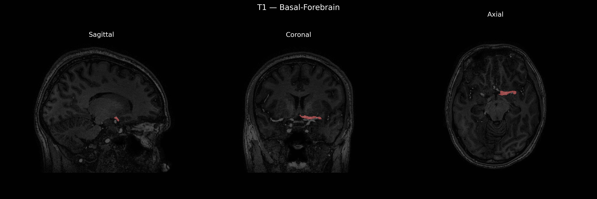
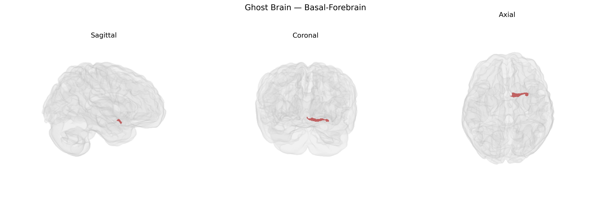

# Basal-Forebrain

## Overview

The left basal forebrain is a ventral telencephalic region situated anterior and inferior to the anterior commissure and the hypothalamus, extending from the medial septal area and diagonal band complex laterally toward the substantia innominata and nucleus basalis of Meynert. It contains heterogeneous neuronal populations, prominently cholinergic projection neurons that innervate widespread cortical and limbic targets and play essential roles in attention, arousal, learning, and memory. The basal forebrain also integrates inputs from brainstem neuromodulatory systems, the amygdala, hippocampus, and prefrontal cortex, thereby participating in the regulation of sleep–wake cycles, motivation, and emotional processing. In the brainCOLOR atlas, the left basal forebrain label encompasses this cluster of nuclei and fiber tracts on the left hemisphere, bounded superiorly by the ventral striatum and anterior limb of the internal capsule and medially by the septal and preoptic regions. There is no direct Wikipedia page for the “Left Basal Forebrain (brainCOLOR)” region; a closely related and encompassing structure is described at: https://en.wikipedia.org/wiki/Basal_forebrain

*Overview generated by GPT-4o (2026).*

---

**Region ID:** 22  
**Hemisphere:** Left  
**Atlas:** brainCOLOR 

---

## Full Brain – Black Background

**Full Quality Version:** [Download MP4](full_black.mp4)

---

## Full Brain – White Background

**Full Quality Version:** [Download MP4](full_white.mp4)

---

## Hemisphere Only – Black Background

**Full Quality Version:** [Download MP4](hemi_black.mp4)

---

## Hemisphere Only – White Background

**Full Quality Version:** [Download MP4](hemi_white.mp4)

---

## Triplanar View – T1 Background

---

## Triplanar View – Ghost Brain


