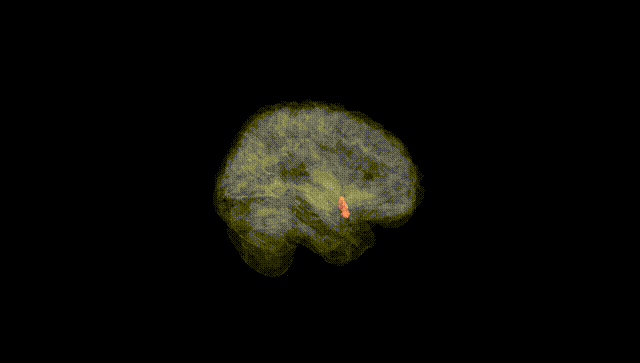
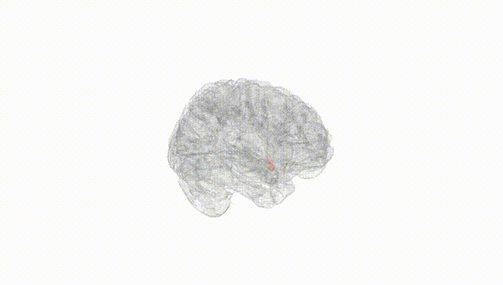
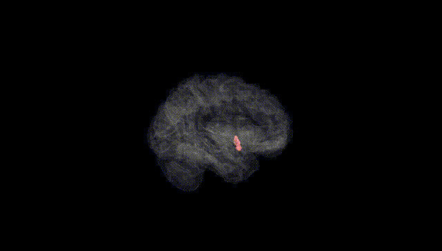
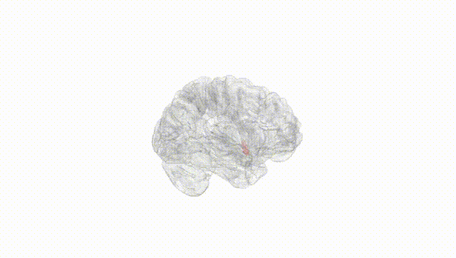
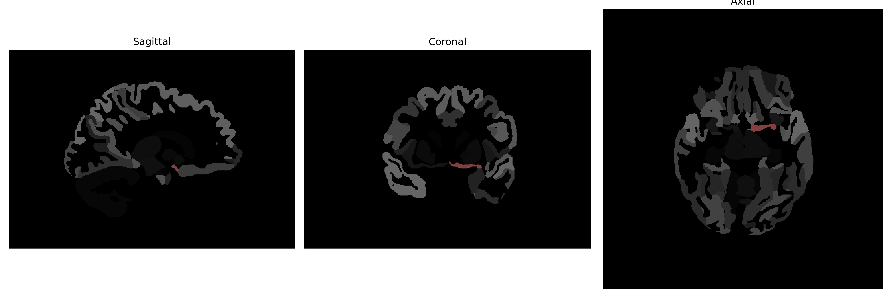

# Basal-Forebrain

## Overview

The Left Basal-Forebrain is a region located at the base of the forebrain, playing crucial roles in various neural processes including learning, memory, and attention. It encompasses several structures, such as the nucleus basalis of Meynert, diagonal band of Broca, substantia innominata, and parts of the hypothalamus and septal area. This region is a primary source of cholinergic neurons, which release the neurotransmitter acetylcholine. These neurons have extensive projections throughout the cortex and are involved in modulating cortical activity and cognitive functions. Dysfunctions in this region have been associated with neurodegenerative conditions like Alzheimer's disease, where the degeneration of cholinergic neurons is a characteristic feature.

There is no direct Wikipedia link for the "Left Basal-Forebrain" specifically, but more information about related areas can be found in the entry for the [Basal Forebrain](https://en.wikipedia.org/wiki/Basal_forebrain).

*Overview generated by GPT-4o (2026).*

---

**Region ID:** 22  
**Hemisphere:** Left  
**Atlas:** brainCOLOR 

---

## Full Brain – Black Background

**Full Quality Version:** [Download MP4](full_black.mp4)

---

## Full Brain – White Background

**Full Quality Version:** [Download MP4](full_white.mp4)

---

## Hemisphere Only – Black Background

**Full Quality Version:** [Download MP4](hemi_black.mp4)

---

## Hemisphere Only – White Background

**Full Quality Version:** [Download MP4](hemi_white.mp4)

---

## Triplanar View (Centered on ROI)

