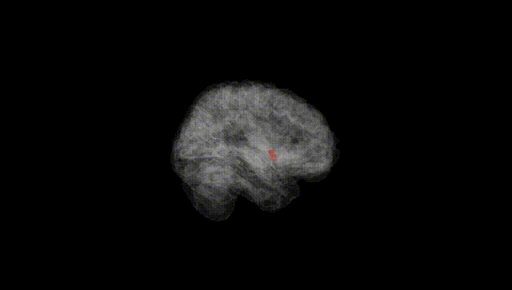
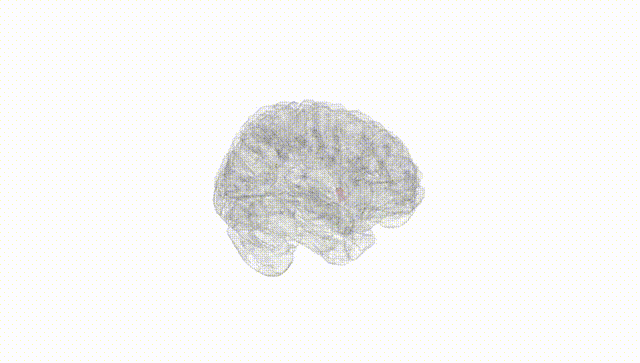
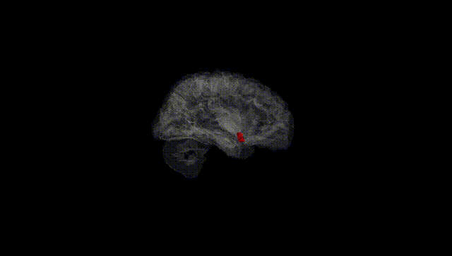
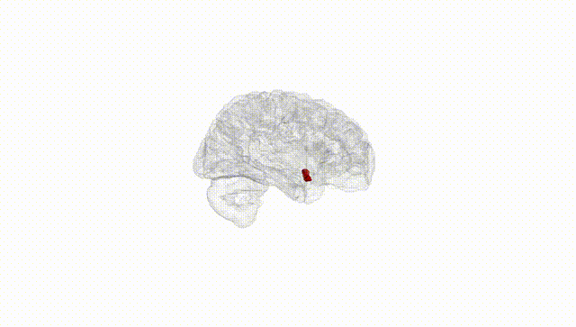
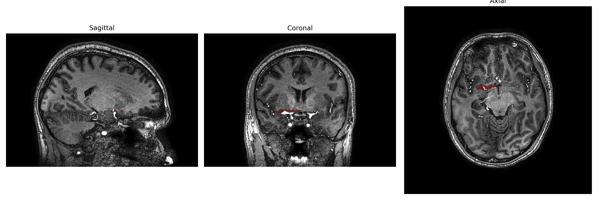
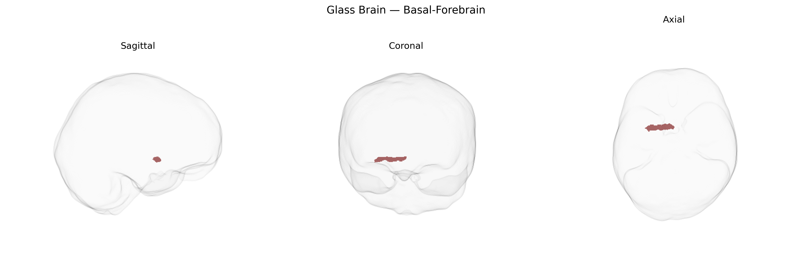

# Basal-Forebrain

## Overview

The right basal forebrain is a ventral telencephalic region located anterior and inferior to the anterior commissure and hypothalamus, comprising cholinergic and non-cholinergic neuronal populations that project widely to the neocortex, hippocampus, and amygdala. It includes nuclei such as the nucleus basalis of Meynert, medial septal nucleus, diagonal band nuclei, and adjacent ventral pallidal and substantia innominata regions. Functionally, the right basal forebrain participates in modulation of cortical arousal, attention, learning, memory consolidation, and sleep–wake regulation through its dense cholinergic innervation, and it is a key site of neurodegeneration in disorders such as Alzheimer’s disease and other dementias. There is no direct Wikipedia entry for “Right Basal Forebrain” as a lateralized structure; a closely related and encompassing article is: https://en.wikipedia.org/wiki/Basal_forebrain

*Overview generated by GPT-4o (2026).*

---

**Region ID:** 23  
**Hemisphere:** Right  
**Atlas:** brainCOLOR 

---

## Basal-Forebrain – Black Background (Full Brain)

**Full Quality Version:** [Download MP4](full_black.mp4)

---

## Basal-Forebrain – White Background (Full Brain)

**Full Quality Version:** [Download MP4](full_white.mp4)

---

## Basal-Forebrain – Black Background (Hemisphere)

**Full Quality Version:** [Download MP4](hemi_black.mp4)

---

## Basal-Forebrain – White Background (Hemisphere)

**Full Quality Version:** [Download MP4](hemi_white.mp4)

---

## Triplanar View – T1 Background

---

## Triplanar View – Ghost Brain


