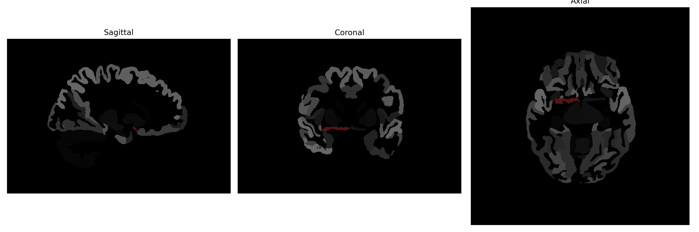

# Basal-Forebrain

## Overview

The Right Basal-Forebrain is a complex region of the brain that plays a critical role in various cognitive functions, including learning, memory, and attention. It is primarily composed of a group of structures located at the base of the forebrain, lateral to the hypothalamus. Significant components of the basal forebrain include the nucleus basalis, medial septal nucleus, and the diagonal band of Broca, which are known for their cholinergic projections to the cerebral cortex. This region is integral to the modulation of neural activity throughout the brain, contributing extensively to arousal and attention processes. Disruptions or degeneration in this area are often associated with neurodegenerative diseases, such as Alzheimer's disease, due to its role in cognition and memory.

There is no direct link to a Wikipedia page specifically for the Right Basal-Forebrain. However, a related area of interest is the "Basal forebrain," which can be explored further here: https://en.wikipedia.org/wiki/Basal_forebrain.

*Overview generated by GPT-4o (2026).*

---

**Region ID:** 23  
**Hemisphere:** Right  
**Atlas:** brainCOLOR 

---

## Full Brain – Black Background

**Full Quality Version:** [Download MP4](full_black.mp4)

---

## Full Brain – White Background

**Full Quality Version:** [Download MP4](full_white.mp4)

---

## Hemisphere Only – Black Background

**Full Quality Version:** [Download MP4](hemi_black.mp4)

---

## Hemisphere Only – White Background

**Full Quality Version:** [Download MP4](hemi_white.mp4)

---

## Triplanar View (Centered on ROI)

