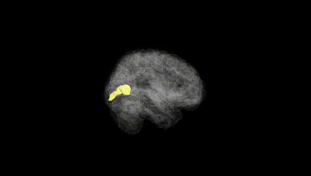
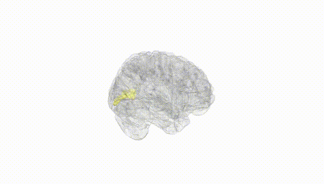
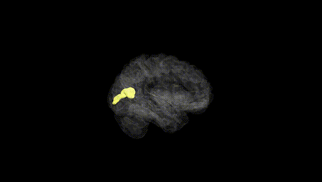
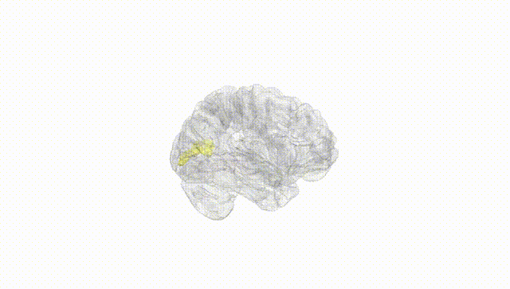
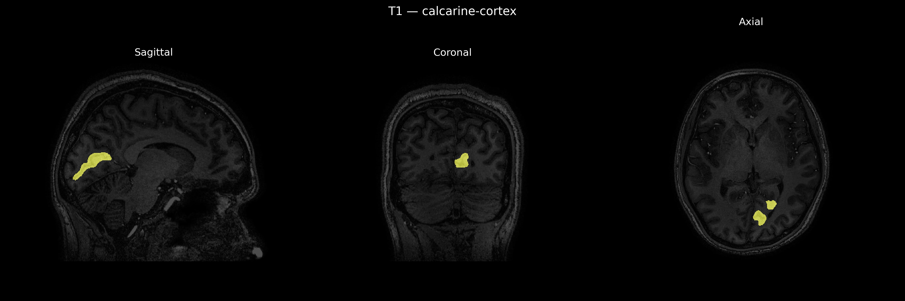
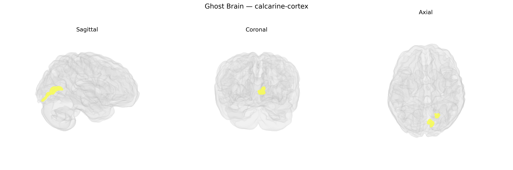

# calcarine-cortex
 
## Overview
 
The Left calcarine cortex corresponds to the portion of primary visual cortex (V1) located along the calcarine sulcus in the medial occipital lobe of the left hemisphere. It receives highly organized retinotopic input from the lateral geniculate nucleus of the thalamus via the optic radiations, with its posterior segment representing central (foveal) vision and more anterior segments representing peripheral visual fields. Neurons in this region are specialized for early-stage processing of visual features such as orientation, spatial frequency, contrast, and motion direction, and they project to higher-order visual areas for further feature integration and object recognition. The left calcarine cortex primarily subserves conscious visual perception of the right visual hemifield and participates in visual awareness, visuospatial processing, and visually guided behavior. [Calcarine sulcus](https://en.wikipedia.org/wiki/Calcarine_sulcus)
 
The left calcarine cortex, encompassing primary visual area V1 as defined in atlases such as brainCOLOR, shows genetic associations primarily through neuroimaging GWAS of cortical structure rather than region-specific single-gene effects. Large-scale studies (e.g., ENIGMA and UK Biobank–based imaging GWAS) have identified variants in genes involved in neurodevelopment, synaptic function, and axon guidance (including loci near genes such as PAX6, TCF4, and others) that influence occipital and calcarine cortical thickness, surface area, and volume. Polygenic architectures for visual cortex measures overlap with genetic risk for neuropsychiatric disorders—most prominently schizophrenia, bipolar disorder, major depression, and autism spectrum disorder—where case–control imaging studies consistently report altered occipital or calcarine morphology or activation, though these are not usually driven by single calcarine-specific loci. Visual cortex metrics including calcarine volume show genetic correlations with cognitive traits (e.g., general cognitive ability, educational attainment) and visual processing performance, and modest genetic overlap has been reported with migraine and epilepsy, conditions that often involve visual aura or occipital involvement. Overall, Twin and SNP-based heritability analyses indicate that structural variation in the calcarine cortex is substantially heritable, but current GWAS implicate broad neurodevelopmental pathways and polygenic risk shared with multiple brain-related disorders rather than a discrete, uniquely calcarine genetic signature.
 
*Overview generated by GPT-4o (2026).*
 
---
 
**Region ID:** 33  
**Hemisphere:** Left  
**Atlas:** brainCOLOR 
 
---
 
## calcarine-cortex – Black Background (Full Brain)
 

 
**Full Quality Version:** <a href="full_black.mp4" download>Download MP4</a>
 
---
 
## calcarine-cortex – White Background (Full Brain)
 

 
**Full Quality Version:** <a href="full_white.mp4" download>Download MP4</a>
 
---

## calcarine-cortex – Black Background (Hemisphere)
 

 
**Full Quality Version:** <a href="hemi_black.mp4" download>Download MP4</a>
 
---
 
## calcarine-cortex – White Background (Hemisphere)
 

 
**Full Quality Version:** <a href="hemi_white.mp4" download>Download MP4</a>
 
---

## Triplanar View – T1 Background
 

 
---
 
## Triplanar View – Ghost Brain
 


