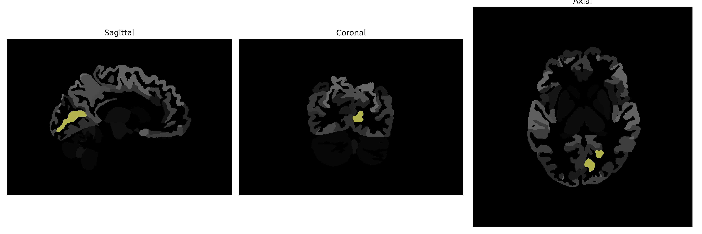

# calcarine-cortex

## Overview

The left calcarine cortex, part of the occipital lobe, is located in the medial aspect of the brain along the calcarine sulcus. This region is primarily involved in processing visual information, specifically receiving input from the contralateral visual field through the optic radiations. The primary visual cortex, also known as V1 or Brodmann area 17, resides within the calcarine cortex and plays a critical role in the initial stages of visual perception, including orientation, spatial frequency, and color processing. The calcarine cortex is essential for the interpretation and comprehension of visual stimuli, forming a fundamental part of the visual pathway.

There is no direct Wikipedia link to the left calcarine cortex, but there is a related link to the primary visual cortex, which it includes: https://en.wikipedia.org/wiki/Primary_visual_cortex

*Overview generated by GPT-4o (2026).*

---

**Region ID:** 33  
**Hemisphere:** Left  
**Atlas:** brainCOLOR 

---

## Full Brain – Black Background

**Full Quality Version:** [Download MP4](full_black.mp4)

---

## Full Brain – White Background

**Full Quality Version:** [Download MP4](full_white.mp4)

---

## Hemisphere Only – Black Background

**Full Quality Version:** [Download MP4](hemi_black.mp4)

---

## Hemisphere Only – White Background

**Full Quality Version:** [Download MP4](hemi_white.mp4)

---

## Triplanar View (Centered on ROI)

