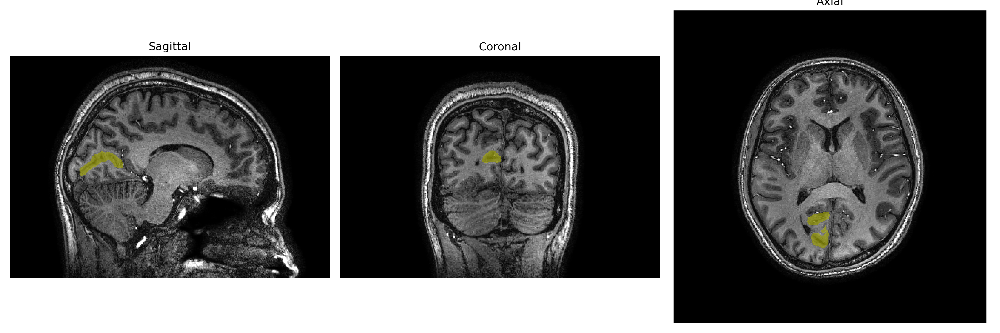
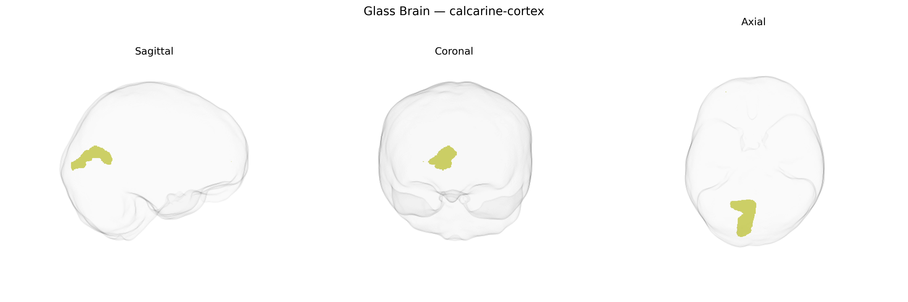

# calcarine-cortex

## Overview

The right calcarine cortex corresponds primarily to the primary visual cortex (V1, Brodmann area 17) located along the banks of the calcarine sulcus in the occipital lobe of the right hemisphere. This region receives the densest thalamocortical input from the lateral geniculate nucleus of the thalamus and is topographically organized such that central (foveal) vision is represented posteriorly and peripheral vision more anteriorly along the sulcus. Neurons in the right calcarine cortex are tuned to basic visual features such as orientation, spatial frequency, contrast, and eye-of-origin, and they contribute to the initial cortical stages of visual processing, including edge detection, contour representation, and binocular disparity. Lesions in the right calcarine cortex typically produce left homonymous visual field defects (e.g., left homonymous hemianopia or quadrantanopia), reflecting the contralateral and retinotopic organization of visual input. In the brainCOLOR atlas, this region is parcellated as a right-hemisphere occipital cortical territory encompassing the cortical mantle surrounding the calcarine fissure. There is no direct Wikipedia link specifically for “right calcarine cortex”; a closely related structure is the primary visual cortex: https://en.wikipedia.org/wiki/Primary_visual_cortex.

*Overview generated by GPT-4o (2026).*

---

**Region ID:** 32  
**Hemisphere:** Right  
**Atlas:** brainCOLOR 

---

## calcarine-cortex – Black Background (Full Brain)

**Full Quality Version:** [Download MP4](full_black.mp4)

---

## calcarine-cortex – White Background (Full Brain)

**Full Quality Version:** [Download MP4](full_white.mp4)

---

## calcarine-cortex – Black Background (Hemisphere)

**Full Quality Version:** [Download MP4](hemi_black.mp4)

---

## calcarine-cortex – White Background (Hemisphere)

**Full Quality Version:** [Download MP4](hemi_white.mp4)

---

## Triplanar View – T1 Background

---

## Triplanar View – Ghost Brain


