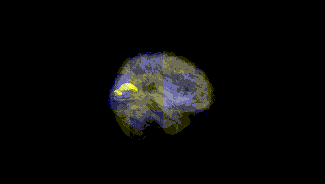
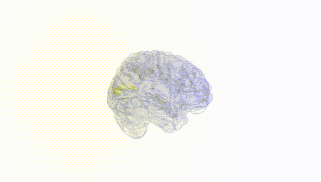
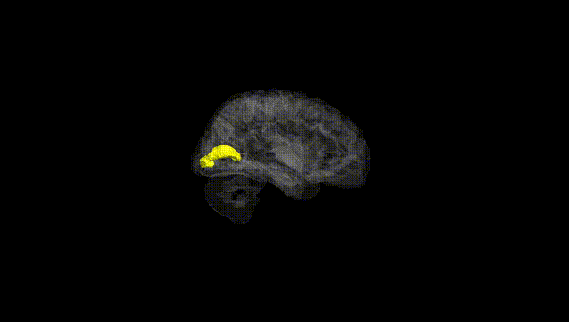
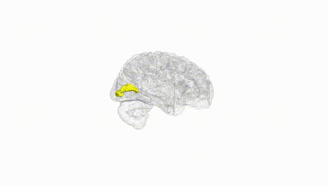
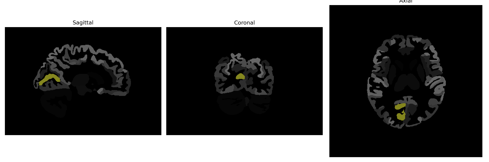

# calcarine-cortex

## Overview

The right calcarine cortex is located in the occipital lobe of the brain and is involved in primary visual processing. It is situated along the calcarine sulcus, which divides the occipital lobe into the lingual gyrus and cuneus. The calcarine cortex serves as the primary visual cortex (V1) and plays an essential role in the initial stage of visual perception, receiving input from the lateral geniculate nucleus of the thalamus. This region is critical for processing visual information such as spatial orientation, motion, and depth perception.

There is no direct Wikipedia link to a description of the right calcarine cortex specifically. However, a related link that may provide useful information is the general article on the "Visual cortex": https://en.wikipedia.org/wiki/Visual_cortex.

*Overview generated by GPT-4o (2026).*

---

**Region ID:** 32  
**Hemisphere:** Right  
**Atlas:** brainCOLOR 

---

## Full Brain – Black Background

**Full Quality Version:** [Download MP4](full_black.mp4)

---

## Full Brain – White Background

**Full Quality Version:** [Download MP4](full_white.mp4)

---

## Hemisphere Only – Black Background

**Full Quality Version:** [Download MP4](hemi_black.mp4)

---

## Hemisphere Only – White Background

**Full Quality Version:** [Download MP4](hemi_white.mp4)

---

## Triplanar View (Centered on ROI)

