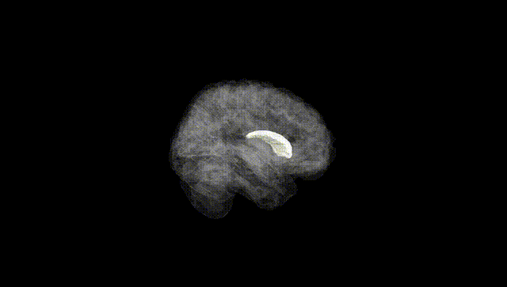
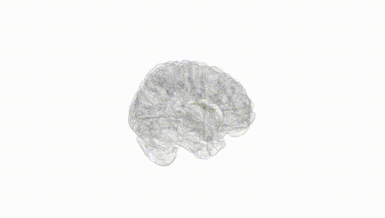
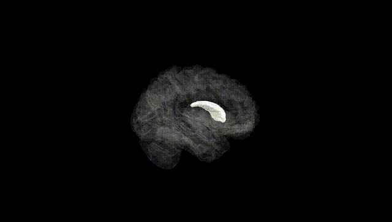
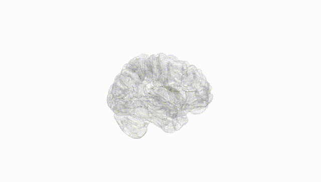
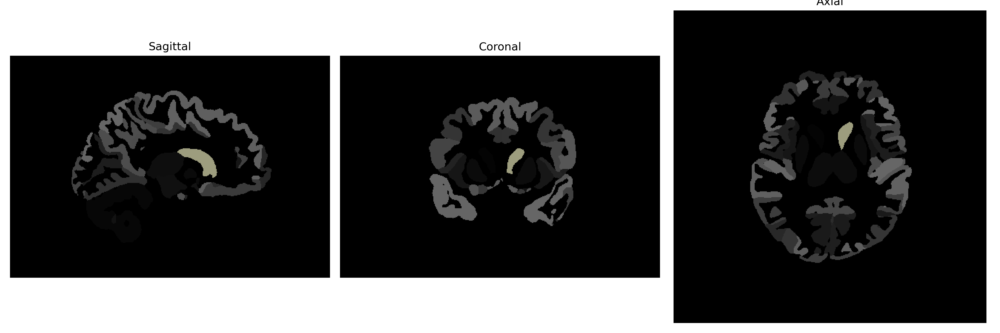

# Caudate

## Overview

The Left Caudate is a part of the brain's basal ganglia, situated medially to the lateral ventricles and adjacent to the thalamus. It is characterized by its elongated, C-shaped structure and consists of a head, body, and tail. This region plays a critical role in various functions such as motor processing, procedural learning, associative learning, executive functions, and emotional regulation. The neuronal activity in the caudate is significant for the planning and modulation of movement pathways. Its involvement in the modulation of brain circuits gives emphasis to the reward systems, influencing cognition and behavior.

There is no direct Wikipedia link to the Left Caudate description from the brainCOLOR Atlas. However, a related article can be found at: [https://en.wikipedia.org/wiki/Caudate_nucleus](https://en.wikipedia.org/wiki/Caudate_nucleus).

*Overview generated by GPT-4o (2026).*

---

**Region ID:** 6  
**Hemisphere:** Left  
**Atlas:** brainCOLOR 

---

## Full Brain – Black Background

**Full Quality Version:** [Download MP4](full_black.mp4)

---

## Full Brain – White Background

**Full Quality Version:** [Download MP4](full_white.mp4)

---

## Hemisphere Only – Black Background

**Full Quality Version:** [Download MP4](hemi_black.mp4)

---

## Hemisphere Only – White Background

**Full Quality Version:** [Download MP4](hemi_white.mp4)

---

## Triplanar View (Centered on ROI)

