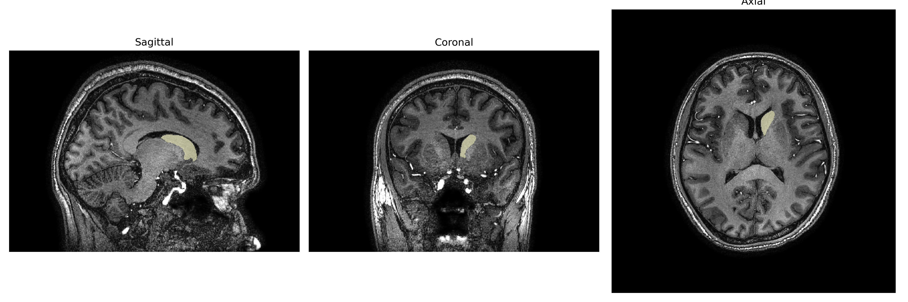
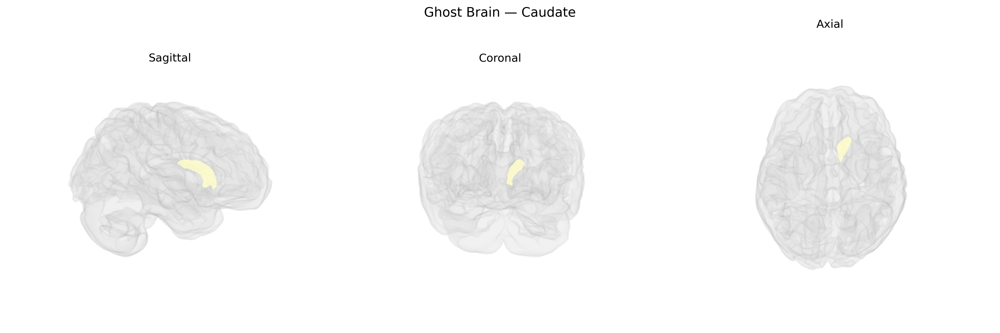

# Caudate
 
## Overview
 
The Left Caudate, as defined in the brainCOLOR Atlas, corresponds to the left caudate nucleus, a C-shaped gray matter structure located in the dorsal striatum of the basal ganglia. It lies adjacent to the lateral ventricle and is composed primarily of medium spiny GABAergic neurons that receive extensive glutamatergic input from widespread cortical regions and dopaminergic projections from the substantia nigra pars compacta. Functionally, the left caudate is involved in motor planning, action selection, habit formation, and various aspects of cognitive and emotional processing, including executive function and reward-related learning, through its participation in cortico-striato-thalamo-cortical loops. Structural and functional abnormalities of the caudate have been implicated in movement disorders such as Parkinson’s disease and Huntington’s disease, as well as in psychiatric conditions including obsessive–compulsive disorder and attention-deficit/hyperactivity disorder. [Caudate nucleus](https://en.wikipedia.org/wiki/Caudate_nucleus)
 
The left caudate, as defined in parcellations such as the brainCOLOR Atlas, shows robust genetic influences on both volume and microstructure, with twin and SNP-heritability studies indicating substantial heritability (often ~40–80%) and partially distinct genetic architectures from the right caudate. Large-scale GWAS of subcortical volumes (e.g., ENIGMA, UK Biobank) have identified multiple loci associated with caudate size, including variants near genes involved in neurodevelopment and synaptic function such as FOXO3, DCC, CRHR1, and genes within dopaminergic and glutamatergic pathways, although most results refer to bilateral or combined caudate measures rather than strictly lateralized left-sided effects. Polygenic risk for neuropsychiatric disorders—including schizophrenia, bipolar disorder, major depression, ADHD, and obsessive–compulsive disorder—has been associated with structural and functional variation in the caudate, and disorder-specific GWAS often implicate genes affecting corticostriatal circuitry that encompasses this region. Additionally, genetic variants linked to Parkinson’s disease, Huntington’s disease (HTT expansions), and other movement disorders influence caudate integrity, with some imaging-genetics work showing left-dominant or asymmetric effects on striatal atrophy and connectivity. Beyond clinical disease, caudate-related GWAS findings connect genetic variation to traits such as cognitive performance, educational attainment, impulsivity, reward sensitivity, and substance use, reflecting the role of frontostriatal genetic architecture in executive function and motivational behavior, though explicit left-caudadte–specific genetic associations remain less commonly reported than those for the caudate as a whole.
 
*Overview generated by GPT-4o (2026).*
 
---
 
**Region ID:** 6  
**Hemisphere:** Left  
**Atlas:** brainCOLOR 
 
---
 
## Caudate – Black Background (Full Brain)
 

 
**Full Quality Version:** <a href="full_black.mp4" download>Download MP4</a>
 
---
 
## Caudate – White Background (Full Brain)
 

 
**Full Quality Version:** <a href="full_white.mp4" download>Download MP4</a>
 
---

## Caudate – Black Background (Hemisphere)
 

 
**Full Quality Version:** <a href="hemi_black.mp4" download>Download MP4</a>
 
---
 
## Caudate – White Background (Hemisphere)
 

 
**Full Quality Version:** <a href="hemi_white.mp4" download>Download MP4</a>
 
---

## Triplanar View – T1 Background
 

 
---
 
## Triplanar View – Ghost Brain
 


