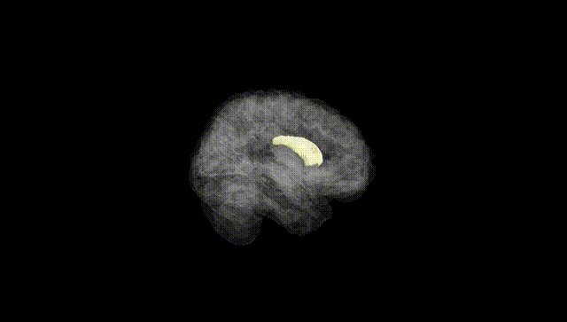
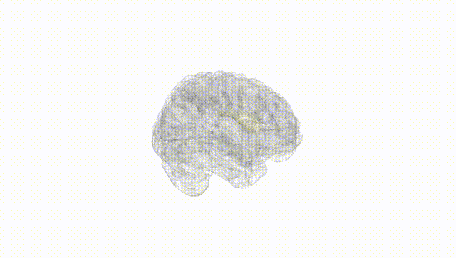
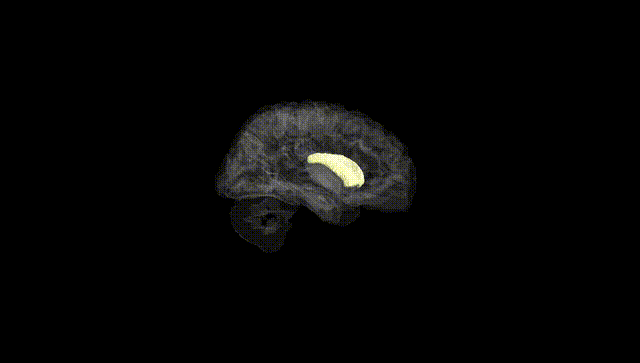
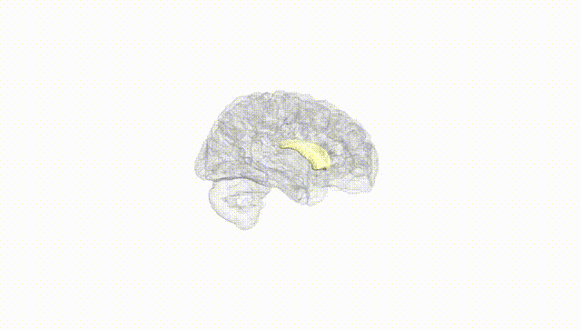
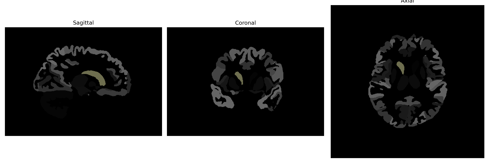

# Caudate

## Overview

The Right Caudate is part of the basal ganglia, a group of subcortical nuclei in the brain that play a vital role in modulating motor, cognitive, and emotional processes. It is located lateral to the lateral ventricle and medial to the internal capsule. The caudate is characterized by its elongated, C-shaped structure, with a head, body, and tail. It is involved in various functions, including learning, memory, and the modulation of movement. Through its connections with other brain regions like the frontal lobe, the right caudate participates in planning and the execution of motor tasks, as well as cognitive control and reward-related processes.

There is no direct Wikipedia link specifically about the Right Caudate; however, more information can be found in the article about the Caudate nucleus: [Wikipedia: Caudate nucleus](https://en.wikipedia.org/wiki/Caudate_nucleus).

*Overview generated by GPT-4o (2026).*

---

**Region ID:** 5  
**Hemisphere:** Right  
**Atlas:** brainCOLOR 

---

## Full Brain – Black Background

**Full Quality Version:** [Download MP4](full_black.mp4)

---

## Full Brain – White Background

**Full Quality Version:** [Download MP4](full_white.mp4)

---

## Hemisphere Only – Black Background

**Full Quality Version:** [Download MP4](hemi_black.mp4)

---

## Hemisphere Only – White Background

**Full Quality Version:** [Download MP4](hemi_white.mp4)

---

## Triplanar View (Centered on ROI)

