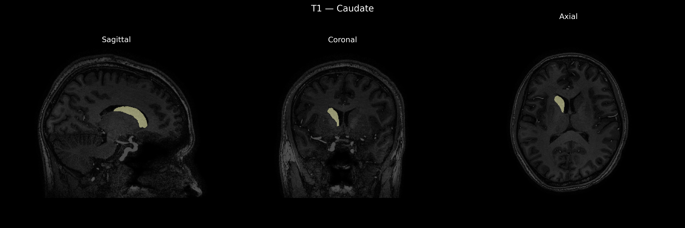
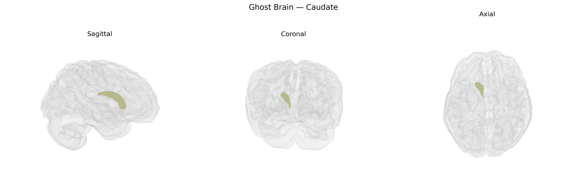

# Caudate

## Overview

The right caudate nucleus is the right-sided component of the caudate, a C-shaped gray matter structure of the dorsal striatum located deep within the telencephalon, adjacent to the lateral ventricle. It consists of a head, body, and tail that curve around the thalamus, and is composed primarily of medium spiny GABAergic neurons that receive dense excitatory glutamatergic input from widespread cortical regions and modulatory dopaminergic input from the substantia nigra pars compacta. As part of the basal ganglia circuitry, the right caudate participates in motor control, action selection, procedural learning, reward processing, and various cognitive and executive functions, with functional lateralization and network asymmetries contributing to hemispheric differences in behavior and pathology. The brainCOLOR Atlas defines “Right Caudate” as the right hemispheric instance of this structure for segmentation and quantitative neuroimaging analyses. There is no direct Wikipedia entry specifically for “Right Caudate” from the brainCOLOR Atlas; a closely related article is the general caudate nucleus entry: https://en.wikipedia.org/wiki/Caudate_nucleus.

*Overview generated by GPT-4o (2026).*

---

**Region ID:** 5  
**Hemisphere:** Right  
**Atlas:** brainCOLOR 

---

## Full Brain – Black Background

**Full Quality Version:** [Download MP4](full_black.mp4)

---

## Full Brain – White Background

**Full Quality Version:** [Download MP4](full_white.mp4)

---

## Hemisphere Only – Black Background

**Full Quality Version:** [Download MP4](hemi_black.mp4)

---

## Hemisphere Only – White Background

**Full Quality Version:** [Download MP4](hemi_white.mp4)

---

## Triplanar View – T1 Background

---

## Triplanar View – Ghost Brain


