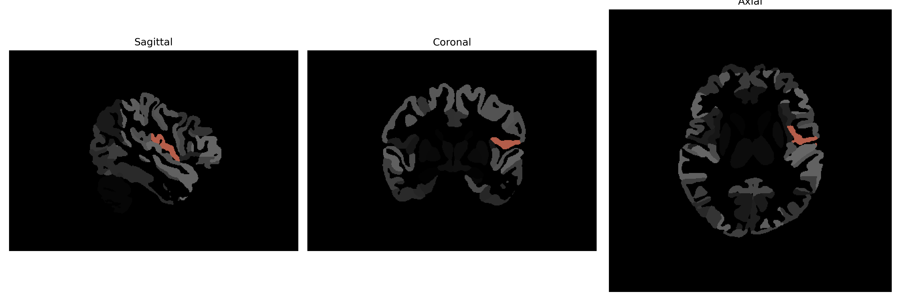

# central-operculum

## Overview

The Left central-operculum in the brain is a complex region found within the frontal lobe and is part of the larger operculum structure, which covers the insula. This area is involved in a range of functions including language processing, motor control, and possibly some aspects of sensory integration. The operculum, as a whole, forms part of the cortical structure that plays a crucial role in higher brain functions. It is strategically situated to integrate information from different regions of the brain, linking sensory inputs with motor and cognitive responses. The mechanisms of its function are still being elucidated, reflecting its significance in neural processing and connectivity within the brain.

There is no direct Wikipedia link for the Left central-operculum. For related information, visit: https://en.wikipedia.org/wiki/Frontal_lobe

*Overview generated by GPT-4o (2026).*

---

**Region ID:** 35  
**Hemisphere:** Left  
**Atlas:** brainCOLOR 

---

## Full Brain – Black Background

**Full Quality Version:** [Download MP4](full_black.mp4)

---

## Full Brain – White Background

**Full Quality Version:** [Download MP4](full_white.mp4)

---

## Hemisphere Only – Black Background

**Full Quality Version:** [Download MP4](hemi_black.mp4)

---

## Hemisphere Only – White Background

**Full Quality Version:** [Download MP4](hemi_white.mp4)

---

## Triplanar View (Centered on ROI)

