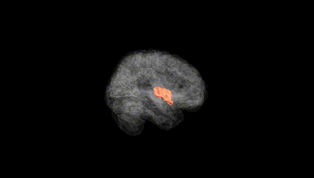
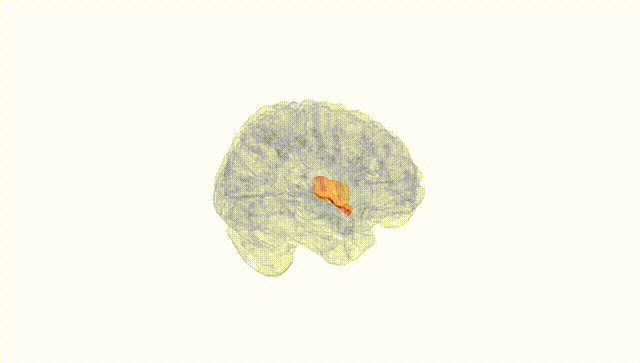
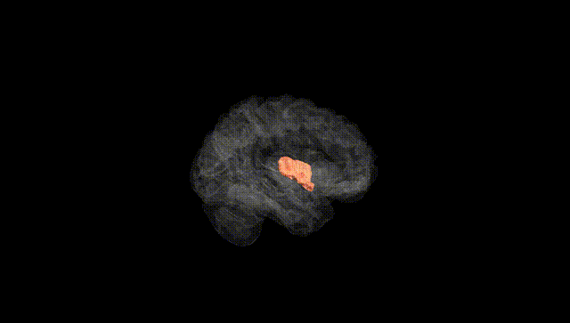
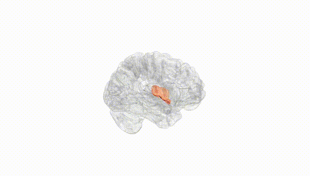
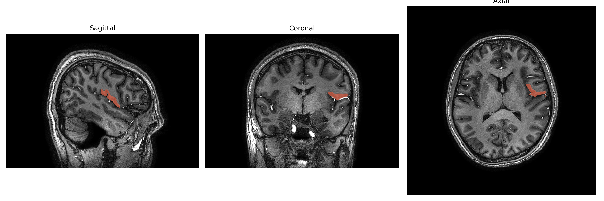
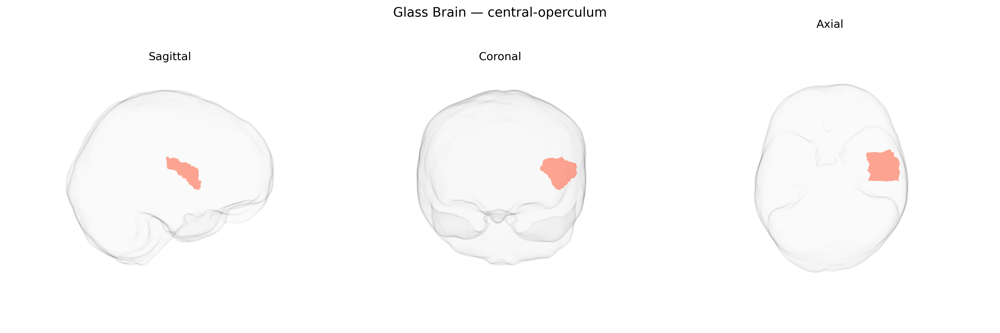

# central-operculum
 
## Overview
 
The Left central-operculum, as defined in the brainCOLOR Atlas, corresponds largely to the left central opercular cortex, a portion of the operculum overlying the insula and situated adjacent to the lower portions of the precentral and postcentral gyri in the perisylvian region. This region participates in sensorimotor integration for orofacial and speech-related movements, somatosensory processing of the face and mouth, and aspects of gustatory and visceral sensation, reflecting its position at the interface of primary sensorimotor areas and insular cortex. Cytoarchitectonically, it contains transitional cortex between primary somatosensory and insular territories and is interconnected with premotor, primary motor, somatosensory, and auditory association areas, supporting roles in articulation, phonological processing, and complex orofacial motor control. There is no direct link; a related structure is the [Operculum (brain)](https://en.wikipedia.org/wiki/Operculum_(brain)).
 
The left central-operculum, a perisylvian region overlapping inferior frontal, insular, and parietal opercular cortex in the brainCOLOR Atlas, has been implicated in several genetic neuroimaging and GWAS-based association studies, though typically under broader cortical labels (e.g., opercular part of inferior frontal gyrus, insula/operculum, perisylvian language and somatosensory regions) rather than as a standalone parcel. Twin and SNP-heritability work indicates moderate to high heritability for cortical thickness and surface area in opercular and insular regions, with common variants in genes involved in neuronal development, synaptic function, and cortical patterning (such as variants near MIR137, CNTNAP2, LRRC4C, and MAPT loci in large MRI-GWAS consortia) contributing to interindividual differences. GWAS of structural and functional MRI measures have linked opercular and insular areas, including left-lateralized perisylvian regions, to polygenic risk scores for schizophrenia, major depression, and bipolar disorder, as well as to autism spectrum traits, impulsivity, and general cognitive ability, though effects are typically distributed and modest. Language- and speech-related genetic signals (e.g., near FOXP2 and other transcriptional regulators of cortico-striatal circuitry) have been associated with activation and structural variation in adjacent inferior frontal/opercular regions, while pain, interoception, and addiction-related genetic studies implicate insular–opercular circuits that encompass the central operculum. Overall, genetic associations involving the left central-operculum are largely inferred from broader opercular/insular and perisylvian phenotypes in large imaging-genetics datasets, with no single gene or variant specifically and uniquely tied to this brainCOLOR-defined parcel.
 
*Overview generated by GPT-4o (2026).*
 
---
 
**Region ID:** 35  
**Hemisphere:** Left  
**Atlas:** brainCOLOR 
 
---
 
## central-operculum – Black Background (Full Brain)
 

 
**Full Quality Version:** <a href="full_black.mp4" download>Download MP4</a>
 
---
 
## central-operculum – White Background (Full Brain)
 

 
**Full Quality Version:** <a href="full_white.mp4" download>Download MP4</a>
 
---

## central-operculum – Black Background (Hemisphere)
 

 
**Full Quality Version:** <a href="hemi_black.mp4" download>Download MP4</a>
 
---
 
## central-operculum – White Background (Hemisphere)
 

 
**Full Quality Version:** <a href="hemi_white.mp4" download>Download MP4</a>
 
---

## Triplanar View – T1 Background
 

 
---
 
## Triplanar View – Ghost Brain
 


