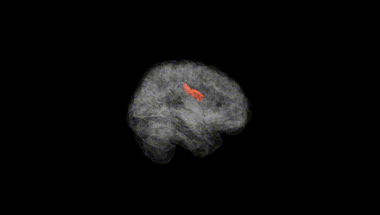
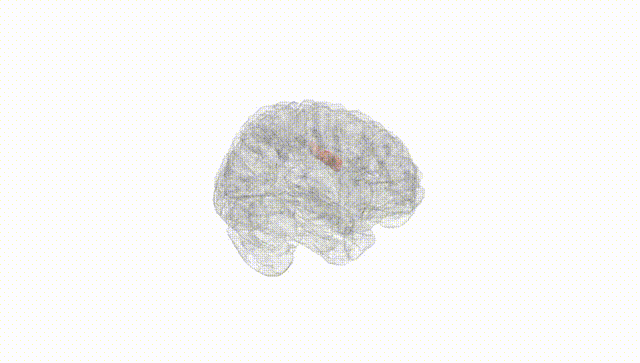
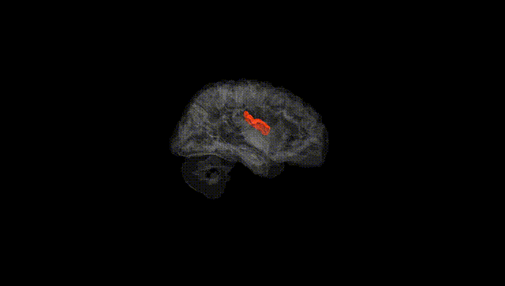
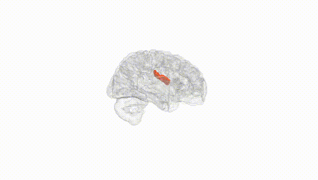
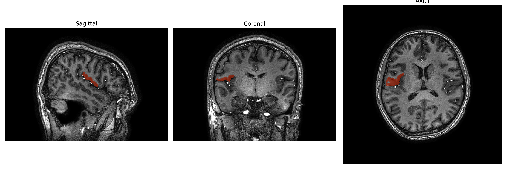
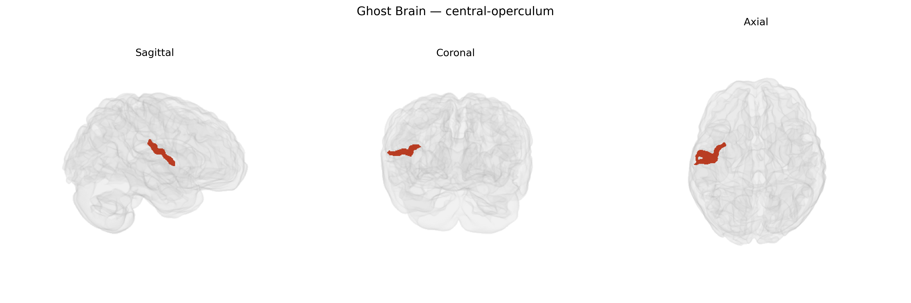

# central-operculum
 
## Overview
 
The right central operculum is a cortical region overlying the insula within the lateral sulcus, forming part of the opercular complex that includes frontal, parietal, and temporal opercula. It corresponds largely to the parietal operculum and portions of the peri-Rolandic cortex, integrating sensorimotor, somatosensory, and associative information from face, mouth, and upper limb representations. This region contributes to fine orofacial motor control, somatosensory discrimination, and aspects of speech articulation and praxis, and it maintains dense reciprocal connections with primary motor and somatosensory cortices, insula, and secondary somatosensory areas. Functionally, it participates in multimodal integration relevant to tactile perception, sensorimotor coordination, and higher-order functions such as language-related motor planning and swallowing. There is no direct link for “central operculum”; a related structure is the [Insular cortex](https://en.wikipedia.org/wiki/Insular_cortex).
 
Genetic associations specific to the right central operculum as defined in the brainCOLOR atlas are not well characterized, but relevant insights come from GWAS and imaging‑genetics studies of opercular and peri‑Sylvian regions more broadly. Variants in genes involved in cortical development and synaptic function—such as CNTNAP2, FOXP2, DCDC2, KIAA0319, and ROBO1—have been implicated in language and speech networks that include opercular cortex, particularly in the left hemisphere but often with bilateral structural or functional effects. Large‑scale GWAS of cortical surface area and thickness (e.g., ENIGMA, UK Biobank–based studies) have identified loci (including variants near MAPT, HMGA2, C15orf54, and others) that influence frontal and temporal opercular morphology, though these are typically reported at lobar or gyral scales rather than at the specific right central‑operculum parcel. Opercular and insula‑adjacent regions have also appeared in imaging‑genetics studies of schizophrenia, major depressive disorder, autism spectrum disorder, and substance use, where polygenic risk scores correlate with altered cortical thickness or volume in opercular territories, but these effects are generally diffuse and not anatomically restricted to the right central operculum. Overall, existing evidence suggests polygenic influences shared with broader language, sensorimotor, and salience‑network regions, yet no robust, parcel‑level GWAS findings or disorder associations are currently established uniquely for the right central‑operculum region in the brainCOLOR framework.
 
*Overview generated by GPT-4o (2026).*
 
---
 
**Region ID:** 34  
**Hemisphere:** Right  
**Atlas:** brainCOLOR 
 
---
 
## central-operculum – Black Background (Full Brain)
 

 
**Full Quality Version:** <a href="full_black.mp4" download>Download MP4</a>
 
---
 
## central-operculum – White Background (Full Brain)
 

 
**Full Quality Version:** <a href="full_white.mp4" download>Download MP4</a>
 
---

## central-operculum – Black Background (Hemisphere)
 

 
**Full Quality Version:** <a href="hemi_black.mp4" download>Download MP4</a>
 
---
 
## central-operculum – White Background (Hemisphere)
 

 
**Full Quality Version:** <a href="hemi_white.mp4" download>Download MP4</a>
 
---

## Triplanar View – T1 Background
 

 
---
 
## Triplanar View – Ghost Brain
 


